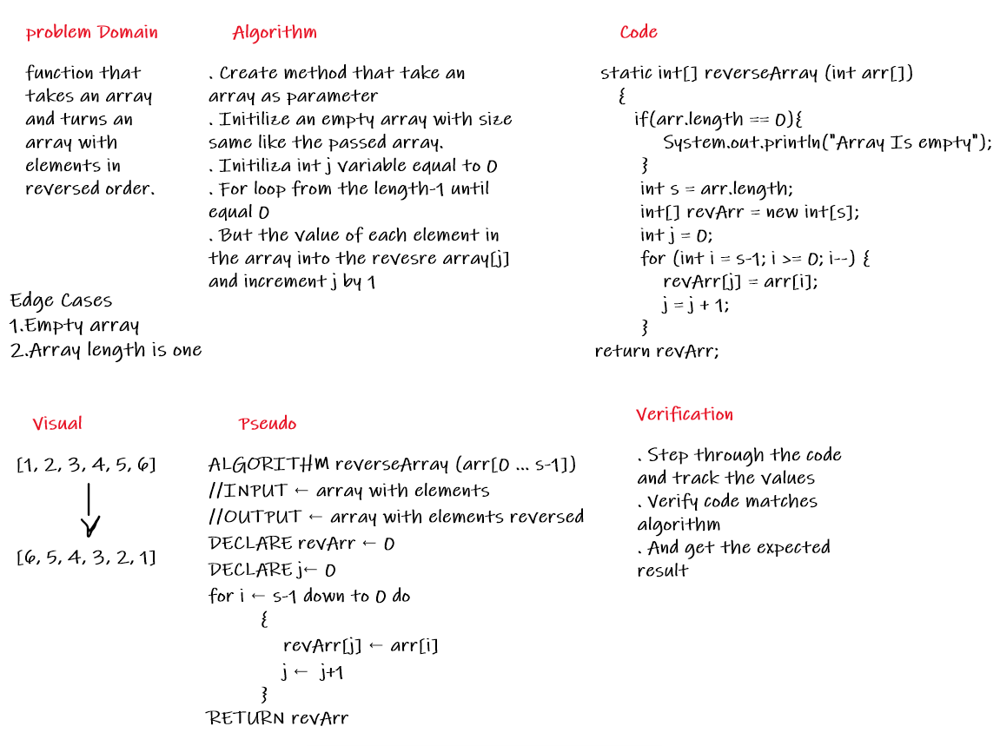

# Reverse an Array

 Function called reverseArray which takes an array as an argument.  
 Return an array with elements in reversed order.

## Whiteboard Process
   

## Approach & Efficiency
* Create method that take an array as parameter.  
* Initilize an empty array with size same like the passed array.  
* Initiliza int j variable equal to 0.  
* For loop from the length-1 until equal 0.   
* But the value of each element in the array into the revesre array[j] and increment j by 1. 

