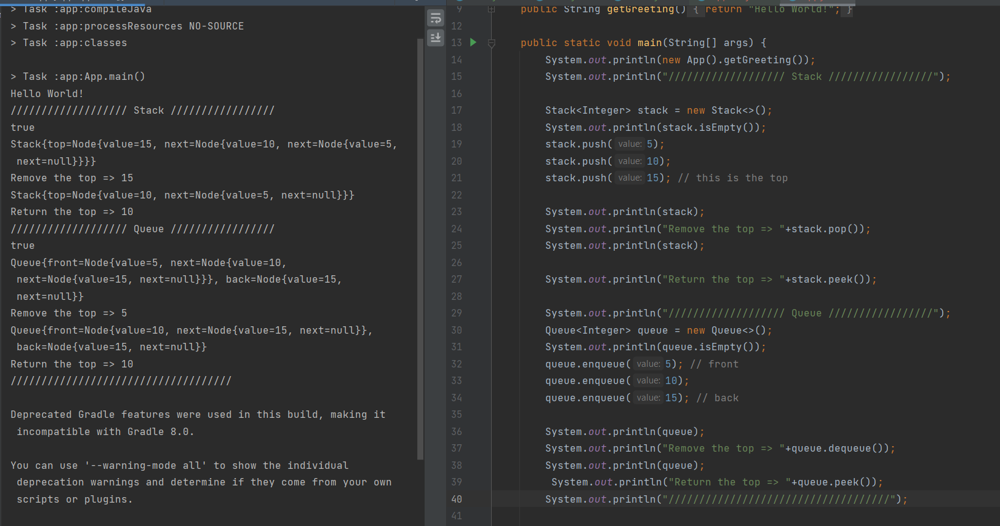

# Stacks and Queues
<!-- Short summary or background information -->
Stack and Queue are a linear data structure that is used to store the collection of objects.  
The concepts of the Stack is Last In Frist Out.  
The concepts of the Queue is First In First Out.  

## Challenge
<!-- Description of the challenge -->
create three classes Node, Stack and Queue. Each Stack and queue have a Methods.  

## Approach & Efficiency
<!-- What approach did you take? Why? What is the Big O space/time for this approach? -->
### Stack  
* **isEmpty** Method : check if the top point to null then return true otherwise is return false.
The Big O space O(1) / time is O(1)    
* **push** Method :  Add the value to the top of the Stack. By check if the stack is empty then just made the top equal the newNode.Else made the newNode.next equal to the top and the top equal the newNode.  
The Big O space O(1) / time is O(1)    
* **pop** Method : Check If the Stack is empty throw exception, Else Return the value from the top of the Stack so we need to save the value so we can return it and then remove the node from the top by let the top equal top.next  
The Big O space O(1) / time is O(1)    
* **peek** Method : Check If the Stack is empty throw exception, Else Return the value from the top of the Stack.  
The Big O space O(1) / time is O(1)    
  
### Queue  
* **isEmpty** Method : check if the front point to null then return true otherwise is return false.
The Big O space O(1) / time is O(1) 
* **enqueue** Method : Check if it is Empty then create a newNode and make the front and back pointer point to it and increment the size of the Queue.Else check if the Queue still has space then add the newNode by let the back.next point to the newNode and the back point to the NewNode.Otherwise will throw an exception because the Queue is Full.   
The Big O space O(1) / time is O(1)  
* **dequeue** Method : Check If the Queue is empty throw exception, Else Return the value from the front of the Queue so we need to save the value so we can return it and then remove the node from the front by make the front equal to front.next and decrement the size of the Queue.   
The Big O space O(1) / time is O(1)   
* **peek** Method : Check If the Queue is empty throw exception, Else Return the value from the front of the Queue.  
The Big O space O(1) / time is O(1)  
  
## API
<!-- Description of each method publicly available to your Stack and Queue-->
### Stack  
* **isEmpty** Method : check if the top point to null then return true otherwise is return false.
The Big O space O(1) / time is O(1)    
* **push** Method : Add the value to the top of the Stack
The Big O space O(1) / time is O(1)    
* **pop** Method : Check If the Stack is empty throw exception, Else Return the value from the top of the Stack so we need to save the value so we can return it and then remove the node from the top 
The Big O space O(1) / time is O(1)    
* **peek** Method : Check If the Stack is empty throw exception, Else Return the value from the top of the Stack.  
The Big O space O(1) / time is O(1)    
  
### Queue  
* **isEmpty** Method : check if the front point to null then return true otherwise is return false.
The Big O space O(1) / time is O(1) 
* **enqueue** Method : Check if it is Empty then create a newNode and make the front and back pointer point to it and increment the size of the Queue.Else check if the Queue still has space then add the newNode by let the back.next point to the newNode and the back point to the NewNode.Otherwise will throw an exception because the Queue is Full.   
The Big O space O(1) / time is O(1)  
* **dequeue** Method : Check If the Queue is empty throw exception, Else Return the value from the front of the Queue so we need to save the value so we can return it and then remove the node from the front and decrement the size of the Queue.   
The Big O space O(1) / time is O(1)   
* **peek** Method : Check If the Queue is empty throw exception, Else Return the value from the front of the Queue.  
The Big O space O(1) / time is O(1)  
  
  