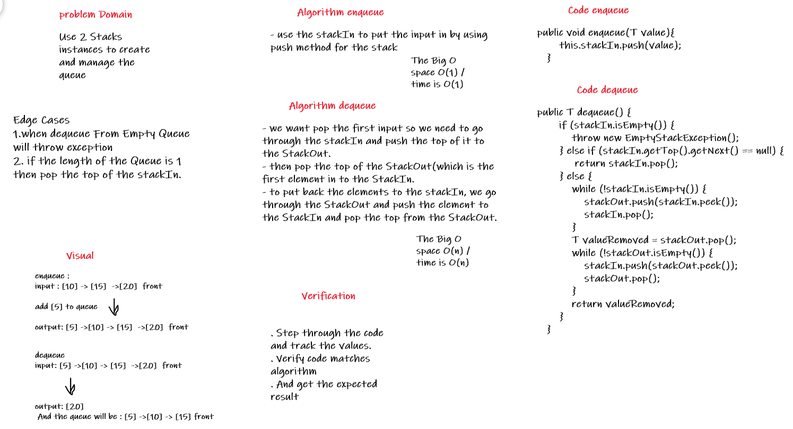
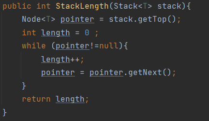
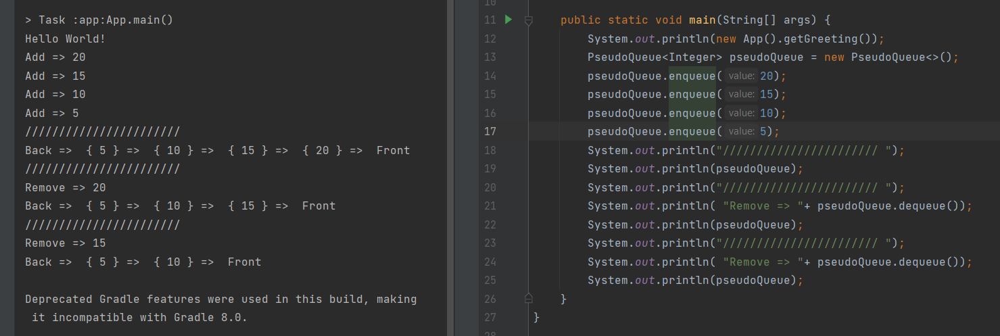

# Challenge Summary
<!-- Description of the challenge -->
Create a new class called pseudo queue.  
Do not use an existing Queue.  
Instead, this PseudoQueue class will implement enqueue and dequeue Methods, Using two Stacks(StackIn to put the input element and StackOut which using it to get the first element and remove it).  
  

## Whiteboard Process
<!-- Embedded whiteboard image -->
  
  
  
## Approach & Efficiency
<!-- What approach did you take? Why? What is the Big O space/time for this approach? -->
* **enqueue** Method : It is add directly to the StackIn by using stack push method.  
The Big O space O(1) / time is O(1)  
* **dequeue** Method : It is put the elements from the stackIn to stackOut by using while loop each time push the element to the satckOut and pop it from stackIn. then pop the last element from the stackOut(which is the first input element) and loop again through the stackOut and push the elements to the stackIn and pop it from stackOut.  
The Big O space O(n) / time is O(n)  
* **StackLength** Method : use it to check if the stackIn has only one element so no need to go through the stackIn and stackOut to do the dequeue.  
  
  

## Solution
<!-- Show how to run your code, and examples of it in action -->
  

[Solution_Link]()  
