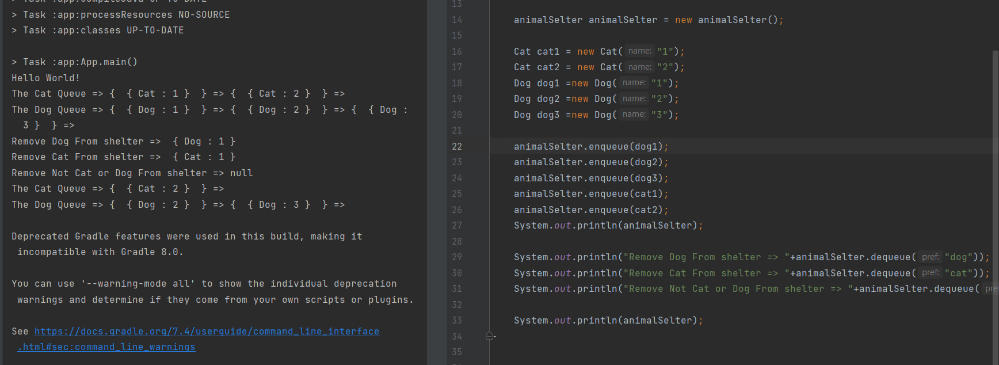

# Challenge Summary
<!-- Description of the challenge -->
Create a class called AnimalShelter which holds only dogs and cats.  
The shelter operates using a first-in, first-out approach.  
And It has two Methods enqueue to add cats or dogs Object and dequeue to Remove either dog or cat from the Shelter.  

## Whiteboard Process
<!-- Embedded whiteboard image -->
  
  
  
## Approach & Efficiency
<!-- What approach did you take? Why? What is the Big O space/time for this approach? -->
* **enqueue** Method : when enqueue an object  
     a. check if it is a cat object then enqueue to the catQueue  
     b. If it is dog object then enqueue to the dogQueue.  
     c. Otherwise, throw Exception.   
The Big O space O(1) / time is O(1)
* **dequeue** Method : when dequeue  
    a. check if the argument is cat then dequeue from the catQueue  
    b. if it is dog then dequeue from the dogQueue  
    c. Otherwise,return null.  
The Big O space O(1) / time is O(1)  

The enqueue and dequeue Methods For the Queue : [Link Challenge#10](https://github.com/AlaaYlula/data-structures-and-algorithms/tree/main/Challenge%2310)  
  
## Solution
<!-- Show how to run your code, and examples of it in action -->
  
