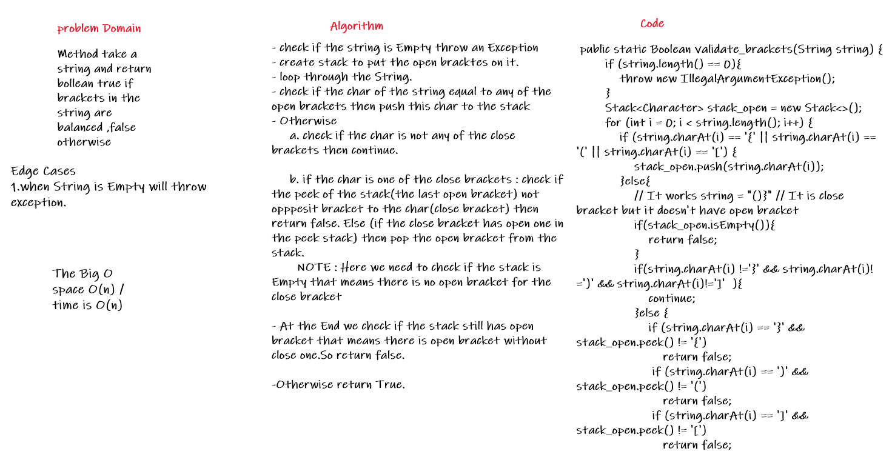
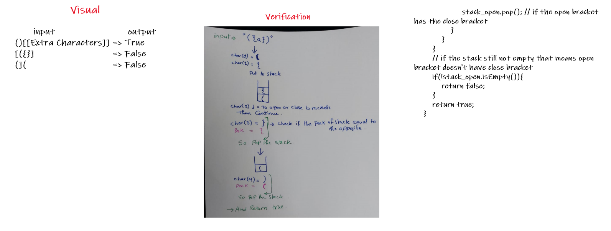
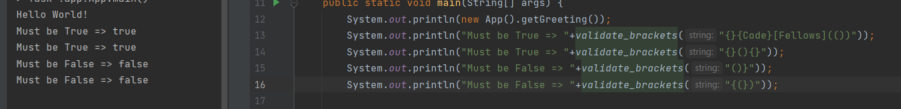

# Challenge Summary
<!-- Description of the challenge -->
Method take a string and return bollean true if  brackets in the string are balanced ,false otherwise  

## Whiteboard Process
<!-- Embedded whiteboard image -->
  
  
  
## Approach & Efficiency
<!-- What approach did you take? Why? What is the Big O space/time for this approach? -->
- check if the string is Empty throw an Exception  
- create stack to put the open bracktes on it.  
- loop through the String.  
- check if the char of the string equal to any of the open brackets then push this char to the stack  
- Otherwise   
     a. check if the char is not any of the close brackets then continue.  

     b. if the char is one of the close brackets : check if the peek of the stack(the last open bracket) not opppesit bracket to the char(close bracket) then return false. Else (if the close bracket has open one in the peek stack) then pop the open bracket from the stack.    
       NOTE : Here we need to check if the stack is Empty that means there is no open bracket for the close bracket  

- At the End we check if the stack still has open bracket that means there is open bracket without close one.So return false.  

- Otherwise return True.  
    
## Solution
<!-- Show how to run your code, and examples of it in action -->
  
  
[Solution_Link]()
