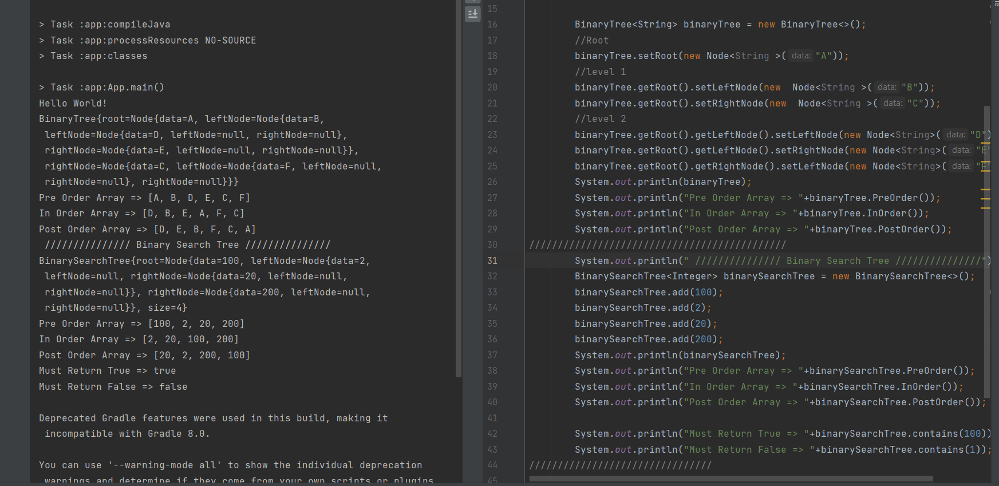

# Trees
<!-- Short summary or background information -->
A tree is a widely used abstract data type that simulates a hierarchical tree structure(non-liner), with a root value and subtrees of children with a parent node, represented as a set of linked nodes.  

The Type of Tree  
* Binary Trees: the number of children for the Nodes are two.   
* Binary Search Trees: all values that are smaller than the root are placed to the left, and all values that are larger than the root are placed to the right.  
## Challenge
<!-- Description of the challenge -->
Implementation for Trees.  
* Create a Binary Tree class has a method for each of the depth first traversals which returns an array of the values, ordered appropriately.  
* Create a Binary Search Tree class with the following additional methods:
1. Add  
Arguments: value  
Return: nothing  
Adds a new node with that value in the correct location in the binary search tree.  
2. Contains  
Argument: value  
Returns: boolean indicating whether or not the value is in the tree at least once.  
## Approach & Efficiency
<!-- What approach did you take? Why? What is the Big O space/time for this approach? -->
### Binary Tree
* **PreOrder** Method : we use the recursion. Each time send the Root Node and the array, and check if the Root Node equal null then stop the recursion we reach the end of this tree, otherwise **add the Root Node** data to the array and check if the **Left** Node not equal to null then call the function again but send the Left node as the Root and the array as parameters for the PreOrder function. And check if the **Right** Node not equal to null then call the function again but send the Right node as the Root and the array as parameters for the PreOrder function. 
The Big O space O(1) / time is O(n)  

* **InOrder** Method : we use the recursion. Each time send the Root Node and the array, and check if the Root Node equal null then stop the recursion we reach the end of this tree, otherwise check if the **Left** Node not equal to null then call the function again but send the Left node as the Root and the array as parameters for the PreOrder function.Then **add the Root Node** data to the array, And check if the **Right** Node not equal to null then call the function again but send the Right node as the Root and the array as parameters for the PreOrder function.  
The Big O space O(1) / time is O(n) 
* **PostOrder** Method : we use the recursion. Each time send the Root Node and the array, and check if the Root Node equal null then stop the recursion we reach the end of this tree, otherwise check if the **Left** Node not equal to null then call the function again but send the Left node as the Root and the array as parameters for the PreOrder function. And check if the **Right** Node not equal to null then call the function again but send the Right node as the Root and the array as parameters for the PreOrder function. Then add the Root Node data to the array.  
The Big O space O(1) / time is O(n)  
### Binary Search Tree 
* **add** Method : check if the tree is Empty so create a node and make it as the root,Otherwise send the root and the value to add constructor which  
1. check if the value less than the root value then go to the left side and check if this left side equal null then add the new Node otherwise call the add Method again and send the left Node as root Node.  
2. check if the value greater than the root value then go to the Right side and check if this Right side equal null then add the new Node otherwise call the add Method again and send the Right Node as root Node. 
The Big O space O(1) / time is O(log n)  
* **contains** Method : check if the root equal to null then this Empty Tree, otherwise send the root and the value to the contains constructor which check  
1. if the value equal to the Node Value then return true.  
2. if the value less than the Node value then call the contains again and send the left node as root.  
3. if the value greater than the Node value then call the contains again and send the Right node as root.  
and the break point for the recursion when the node equal to null that means the value not in the tree then return false.    
The Big O space O(1) / time is O(log n)  

## API
<!-- Description of each method publicly available in each of your trees -->
  
  

[Solution_Link](https://github.com/AlaaYlula/data-structures-and-algorithms/tree/main/Challenge%2315/tree/app/src/main/java/tree)  