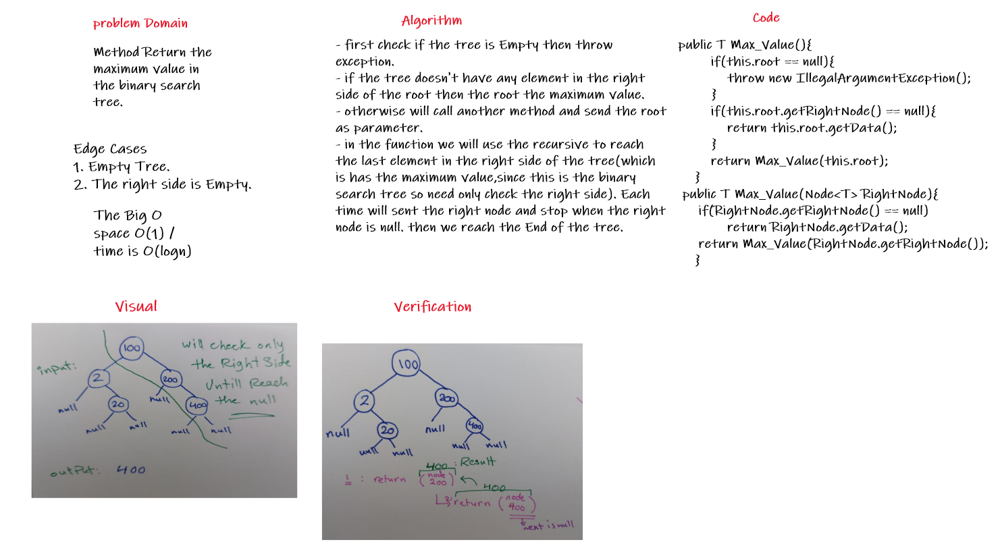
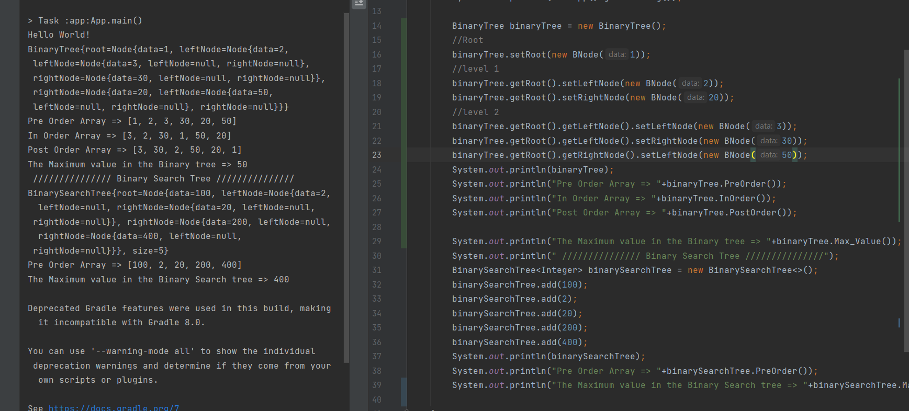

# Challenge Summary
<!-- Description of the challenge -->
Method Return the maximum value in the binary search tree.  

## Whiteboard Process
<!-- Embedded whiteboard image -->
  

## Approach & Efficiency
<!-- What approach did you take? Why? What is the Big O space/time for this approach? -->
- first check if the tree is Empty then throw exception.  
- if the tree doesn't have any element in the right side of the root then the root the maximum value.  
- otherwise will call another method and send the root as parameter.   
- in the function we will use the recursive to reach the last element in the right side of the tree(which is has the maximum value,since this is the binary search tree so need only check the right side). Each time will sent the right node and stop when the right node is null. then we reach the End of the tree.   

The Big O space O(1) / time is O(logn) since we check only the right side of the binary search tree.  
## Solution
<!-- Show how to run your code, and examples of it in action -->
   

