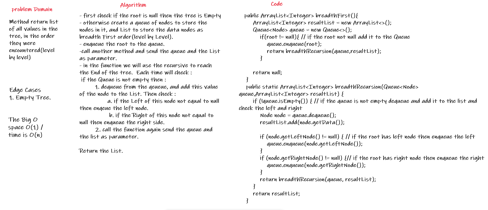
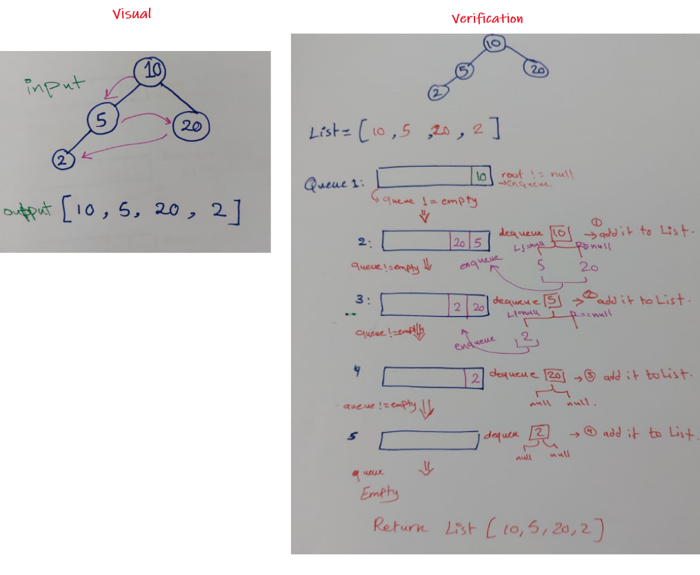
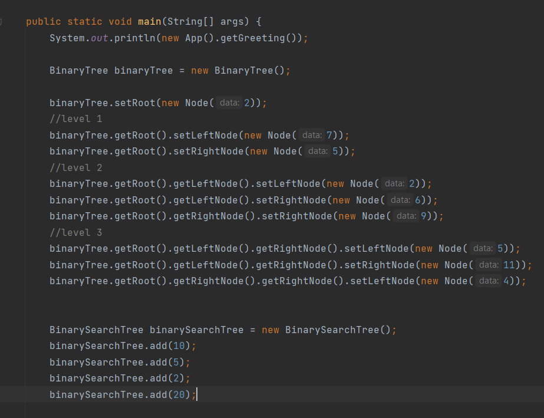
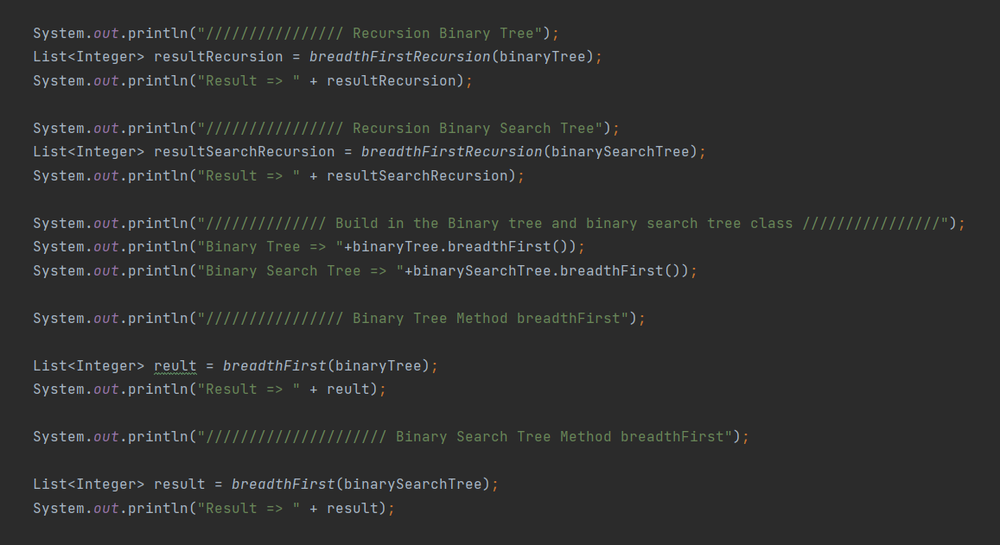
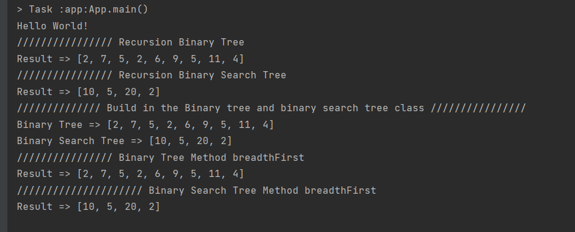

# Challenge Summary
<!-- Description of the challenge -->
Method return list of all values in the tree, in the order they were encountered(level by level).  

## Whiteboard Process
<!-- Embedded whiteboard image -->
  
  
  
## Approach & Efficiency
<!-- What approach did you take? Why? What is the Big O space/time for this approach? -->
- first check if the root is null then the tree is Empty  
- otherwise create a queue of nodes to store the nodes in it, and List to store the data nodes as breadth First order(level by Level).   
- enqueue the root to the queue.  
- call another method and send the queue and the List as parameter.   
- in the function we will use the recursive to reach the End of the tree.  Each time will check :   
 if the Queue is not empty then :   
         1. dequeue from the qeueue, and add this value of the node to the List. Then check :  
                a. if the Left of this node not equal to null then enqeue the left node.  
                b. if the Right of this node not equal to null then enqueue the right side.  
         2. call the function again send the queue and the list as parameter.  

- Return the List.    

## Solution
<!-- Show how to run your code, and examples of it in action -->
  
    
  

[Solution_Link](https://github.com/AlaaYlula/data-structures-and-algorithms/tree/main/Challenge%2317/breadth_first/app/src/main/java/breadth_first)
