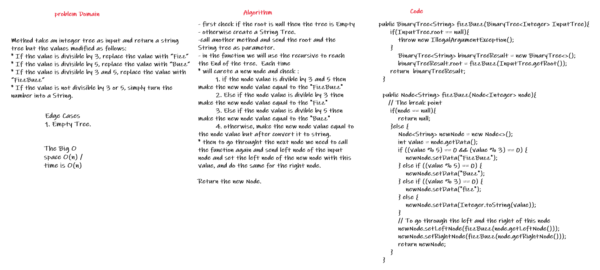
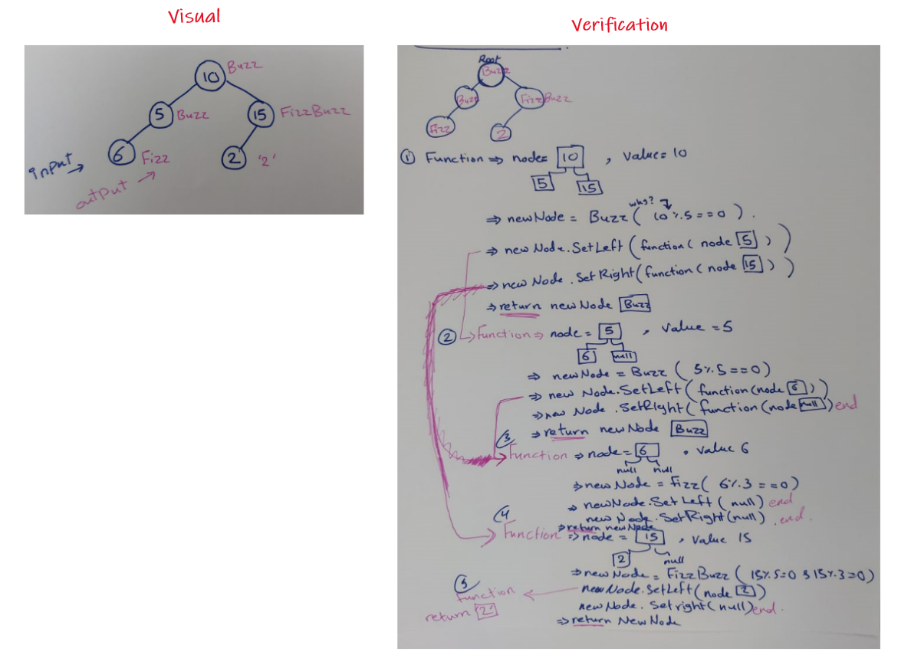
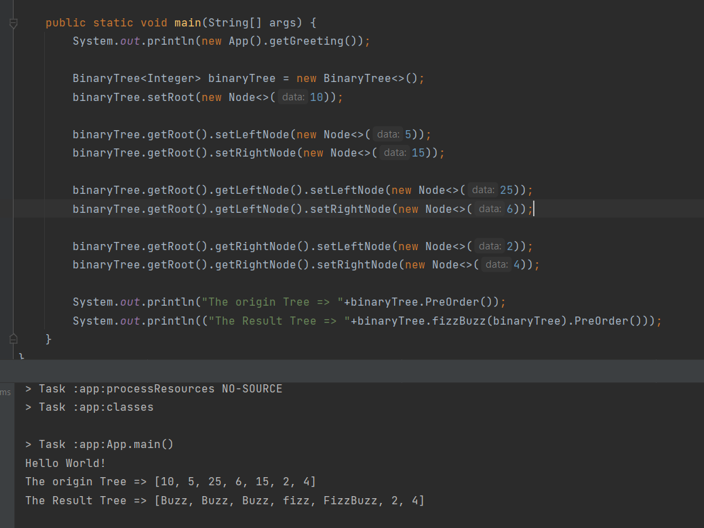

# Challenge Summary
<!-- Description of the challenge -->
Method take an integer tree as input and return a string tree but the values modified as follows:  
* If the value is divisible by 3, replace the value with “Fizz”  
* If the value is divisible by 5, replace the value with “Buzz”  
* If the value is divisible by 3 and 5, replace the value with “FizzBuzz”  
* If the value is not divisible by 3 or 5, simply turn the number into a String.  
## Whiteboard Process
<!-- Embedded whiteboard image -->
  
  

## Approach & Efficiency
<!-- What approach did you take? Why? What is the Big O space/time for this approach? -->
- first check if the root is null then the tree is Empty  
- otherwise create a String Tree.     
- call another method and send the root and the String tree as parameter.   
- in the function we will use the recursive to reach the End of the tree. Each time   
* will carete a new node and check :   
         1. if the node value is divible by 3 and 5 then make the new node value equal to the "FizzBuzz"  
         2. Else if the node value is divible by 3 then make the new node value equal to the "Fizz"  
         3. Else if the node value is divible by 5 then make the new node value equal to the "Buzz"  
         4. otherwise, make the new node value equal to the node value but after convert it to string.   
* then to go throught the next node we need to call the function again and send left node of the input node and set the left node of the new node with this value, and do the same for the right node.   

- Return the new Node.  
The Big O space O(n) / time is O(n)  
## Solution
<!-- Show how to run your code, and examples of it in action -->
  