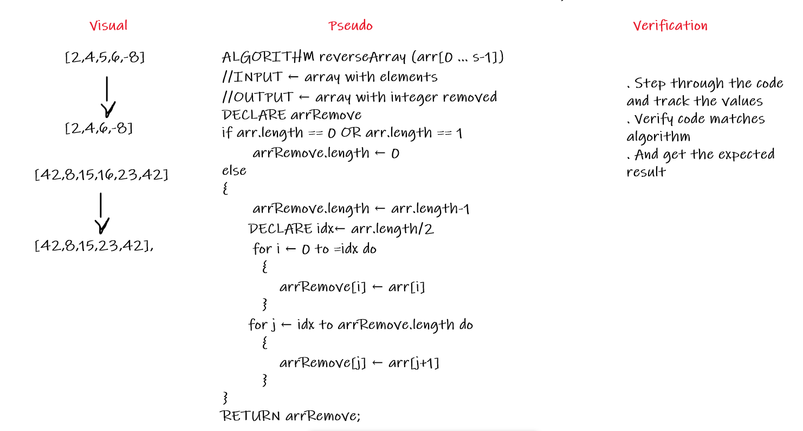

# Insert to Middle of an Array
<!-- Description of the challenge -->
Create a function called insertShiftArray which takes in an array and a value to be added.And return an array with the new value added at the middle index.  

## Whiteboard Process
<!-- Embedded whiteboard image -->

## Approach & Efficiency
<!-- What approach did you take? Discuss Why. What is the Big O space/time for this approach? -->
* Create method that take an array and integer as parameter.  
* Initilize an empty array with size as the passed array+1.  
* let the idx=arr.length/2 and see:if the array has a even length then > For loop from the index 0 until idx and copy the values in the   array passed to the array which we need to add the value to it.and then add num at this idx Else if the array has odd length then  For loop from the index 0 until =idx and copy the values in the array passed to the array which we need to add the value to it. and add num in idx+1.  
* For loop from idx+1 until new array length and countinue copy the values in the array passed to the array which we need to add the value to it.  
* Return an array with the added integer.  

# Delete the Middle Element of an Array
<!-- Description of the challenge -->
Create a function called deleteMiddleElement which takes in an array.And return an array after delete the value in the middle.    

## Whiteboard Process
<!-- Embedded whiteboard image -->

## Approach & Efficiency
<!-- What approach did you take? Discuss Why. What is the Big O space/time for this approach? -->
* Create method that take an array as parameter  
* If the array length is 0 or 1 return an empty array Otherwise :  
* Initilize an empty array with size as the passed array-1.  
* let the idx=arr.length/2.  
* For loop from 0 until equal idx and copy the values in the array passed to the array which we need to remove the middle element from it.  
* For loop from idx until equal length of the remove array and continue copy the values in the array passed to the array which we need to remove the middle element from it.  
* Return an array which we removed the integer from it.  