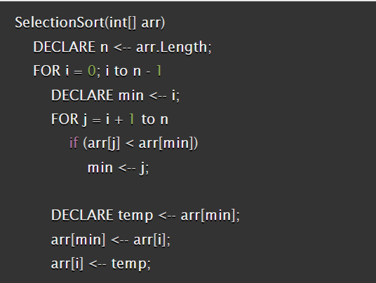
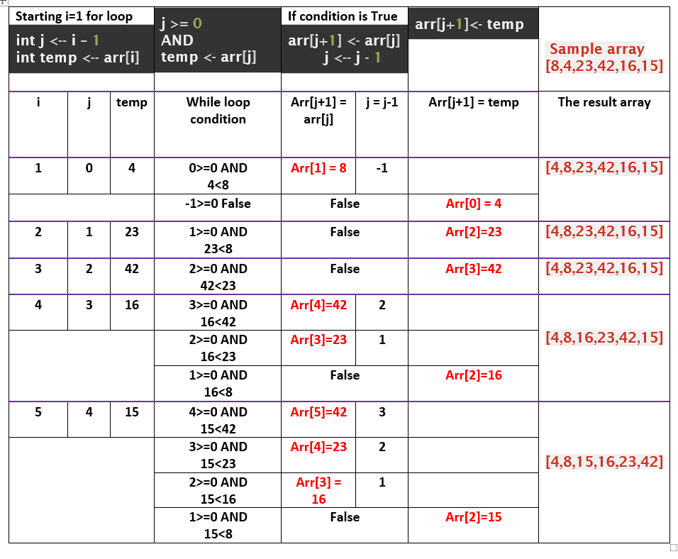
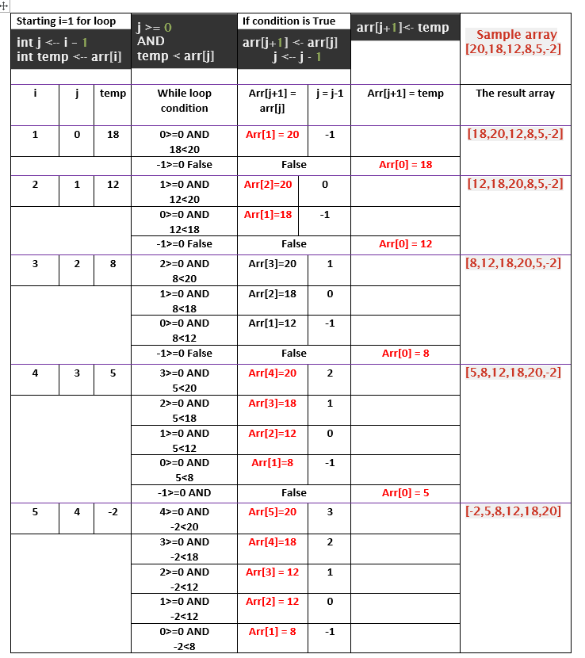
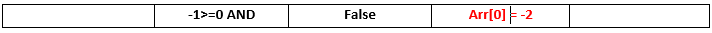
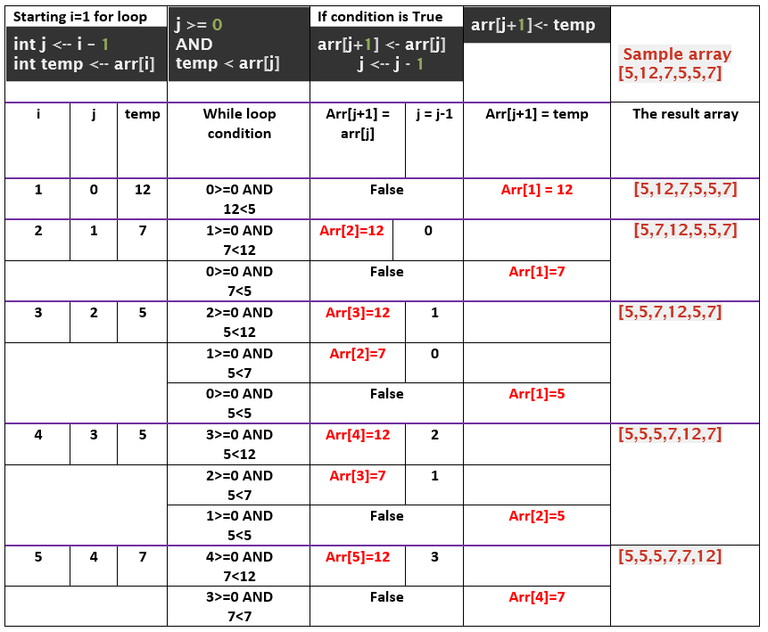
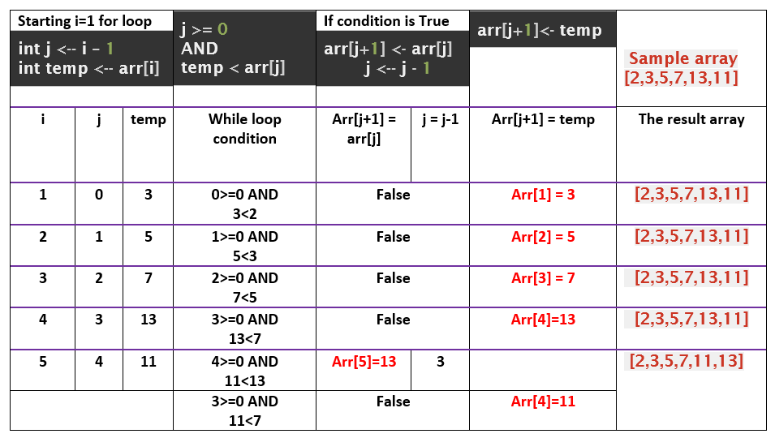

# Insertion Sort
Sort the array by check the value in the index with the previous values in the array and if it is smaller than the value then move the values in the array to the right of the array until reach the beginning of the array or when the value become greater than the value in the array.  

# Pseudocode
  

# Trace
* **Sample**  
  
  
* **Reverse-sorted: [20,18,12,8,5,-2]**  
  
  
  
* **Few uniques: [5,12,7,5,5,7]**  
  
  
* **Nearly-sorted: [2,3,5,7,13,11]**  
  
  