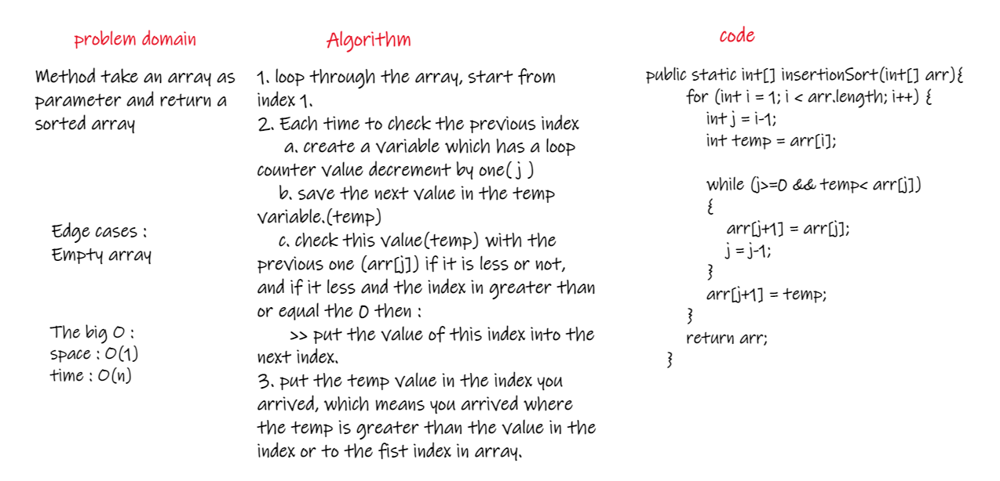
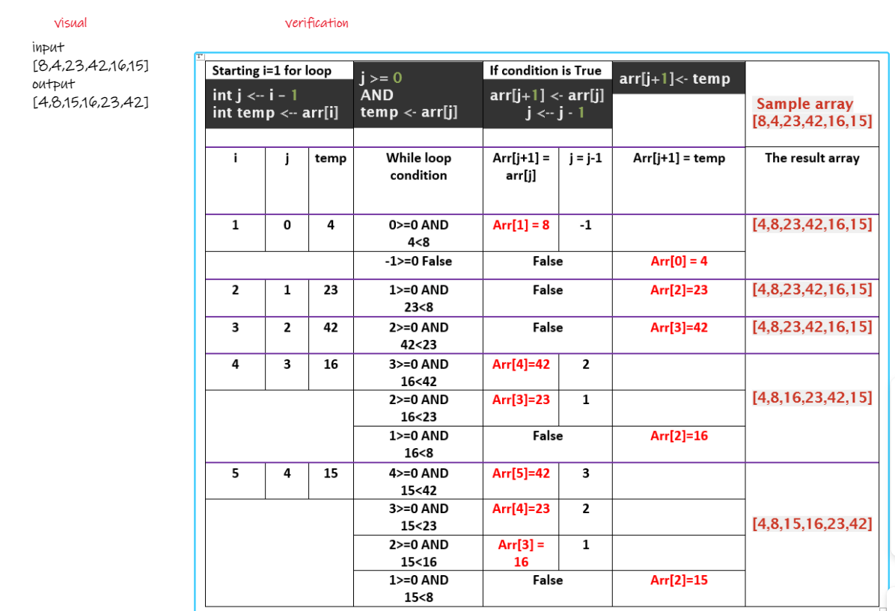
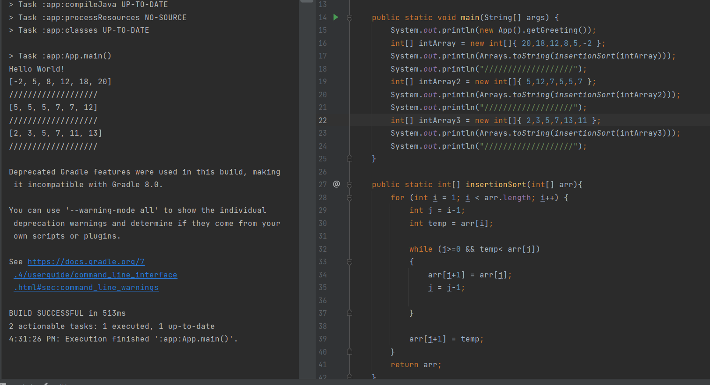

# Challenge Summary
<!-- Description of the challenge -->
Method take an array as a parameter and return an sorted array.   
  
## Whiteboard Process
<!-- Embedded whiteboard image -->
  
  
## Approach & Efficiency
<!-- What approach did you take? Why? What is the Big O space/time for this approach? -->
1. loop through the array, start from index 1.  
2. Each time to check the previous index   
     a. create a variable which has a loop counter value decrement by one( j )  
     b. save the next value in the temp variable.(temp)  
     c. check this value(temp) with the previous one (arr[j]) if it is less or not, and if it less and the index in greater than or equal the 0 then : put the value of this index into the next index.  
3. put the temp value in the index you arrived, which means you arrived where the temp is greater than the value in the index or to the fist index in array.   

The Big O space O(1) / time is O(n).  
  
## Solution
<!-- Show how to run your code, and examples of it in action -->
  

[Solution_Link]()