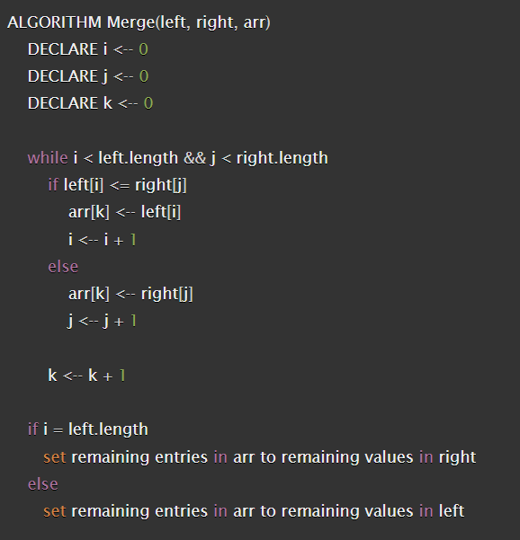
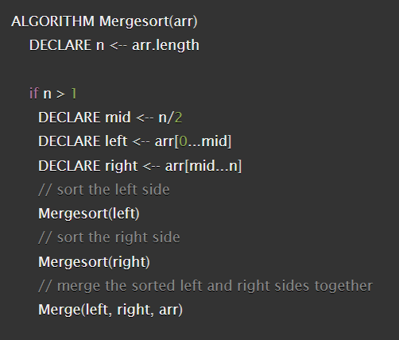
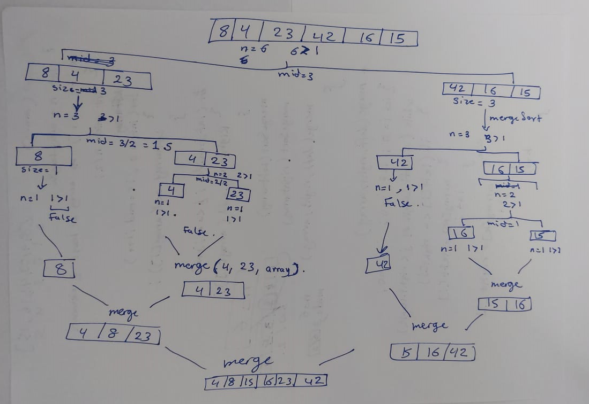
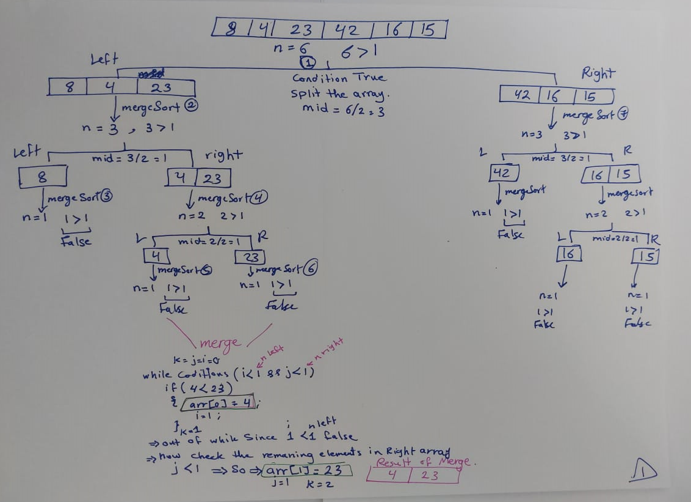
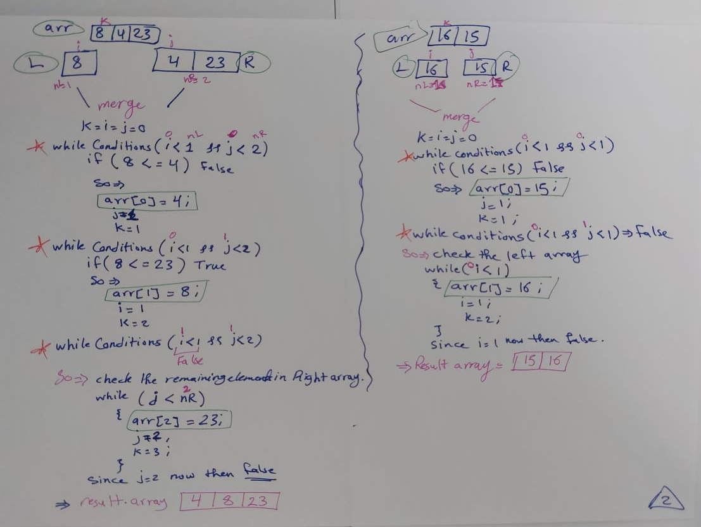
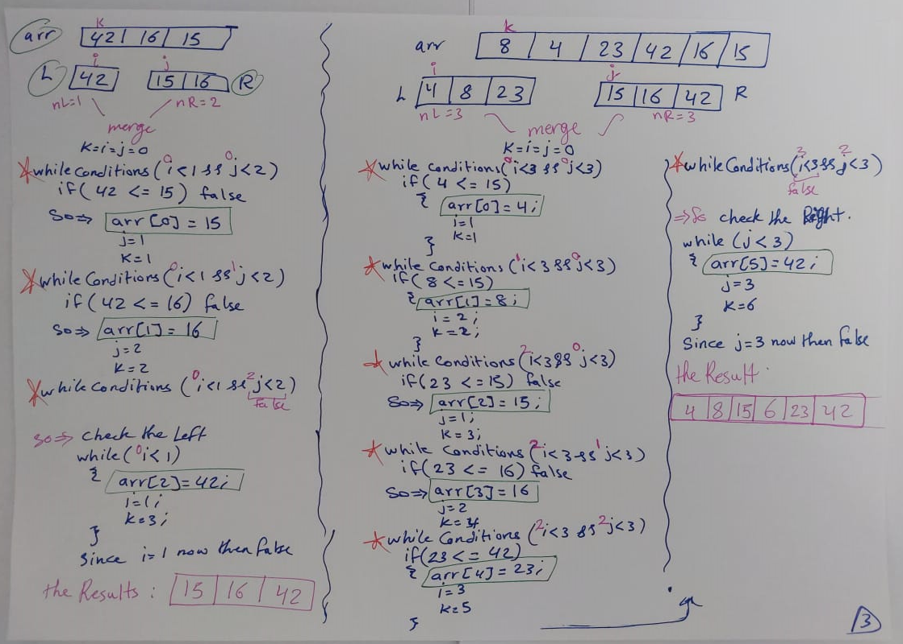

# Merge Sort 
Sort the array by dividing it into two halves and keep doing that until reaching an array with one element. Then merge the Left array with the right array and sort it.  
  
# Pseudo Code
* **Merge Method**  
  
  
  

# Trace 
* **The Sample Array [8,4,23,42,16,15]**  
* The whole Idea  
   
  
* Tracing the mergeSort: 
  
  
* Tracing the merge:  
  
  
  