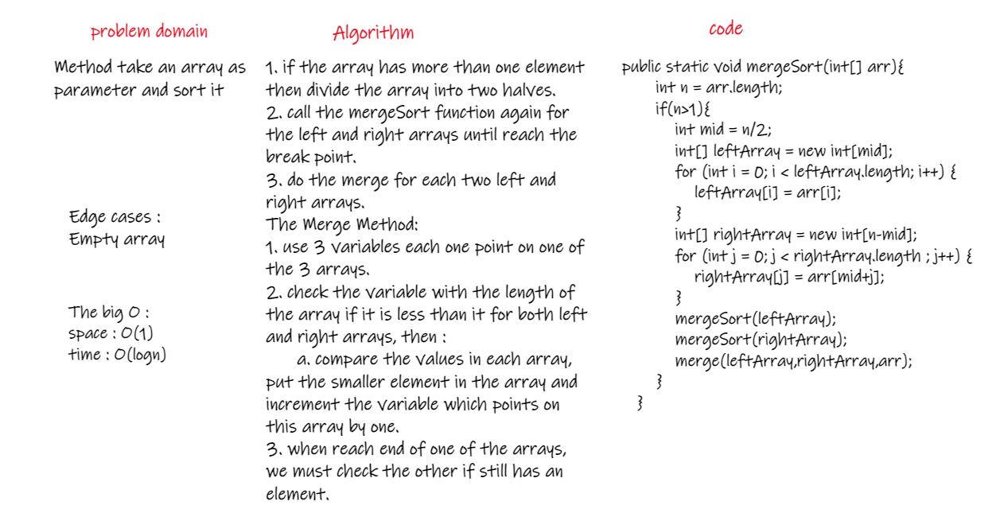
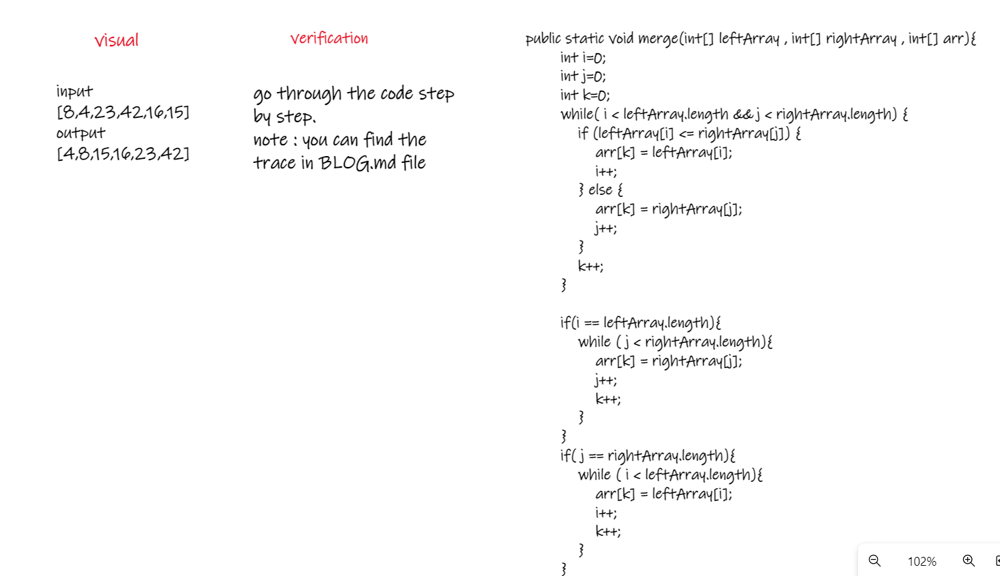
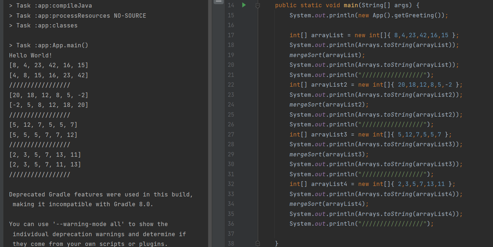

# Challenge Summary
<!-- Description of the challenge -->
Method take an array as parameter and sort it.  

## Whiteboard Process
<!-- Embedded whiteboard image -->
  
  
  
## Approach & Efficiency
<!-- What approach did you take? Why? What is the Big O space/time for this approach? -->
**The mergeSort Method:**   
1. if the array has more than one element then divide the array into two halves.   
2. call the mergeSort function again for the left and right arrays until reach the break point.  
3. do the merge for each two left and right arrays.  
**The Merge Method:**   
1. use 3 variables each one point on one of the 3 arrays.  
2. check the variable with the length of the array if it is less than it for both left and right arrays, then :  
      a. compare the values in each array, put the smaller element in the array and increment the variable which points on this array by one.   
3. when reach end of one of the arrays, we must check the other if still has an element.   
  
The Big O space O(1) / time is O(n).  
  
  
## Solution
<!-- Show how to run your code, and examples of it in action -->
  
  
[Solution_Link]()  