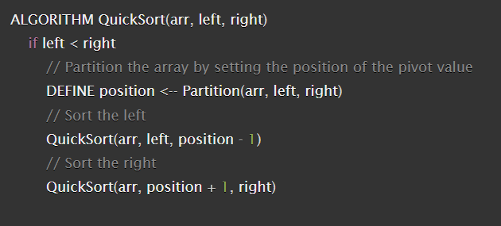
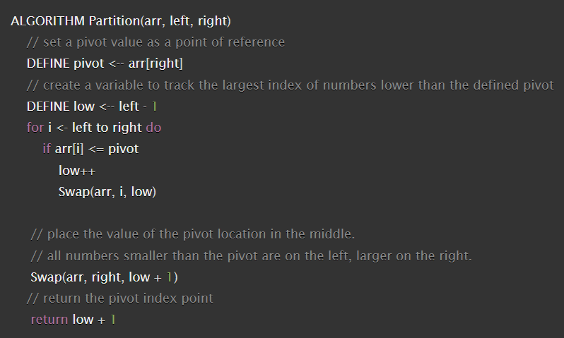
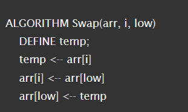
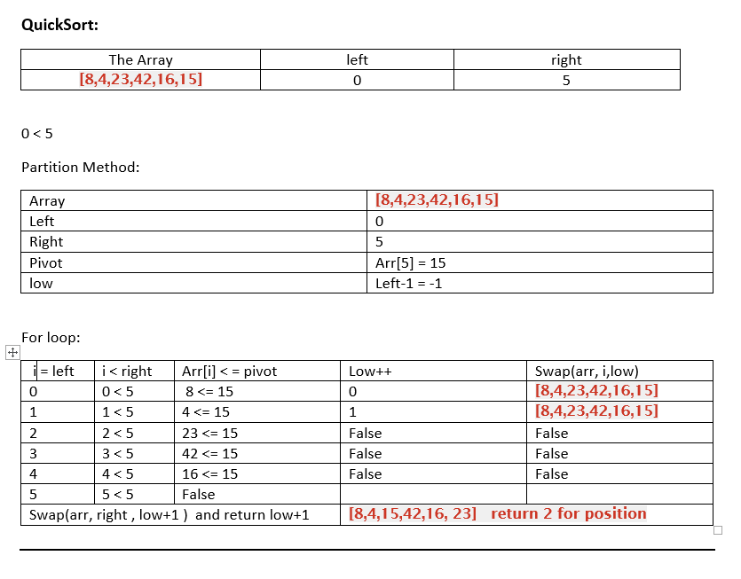
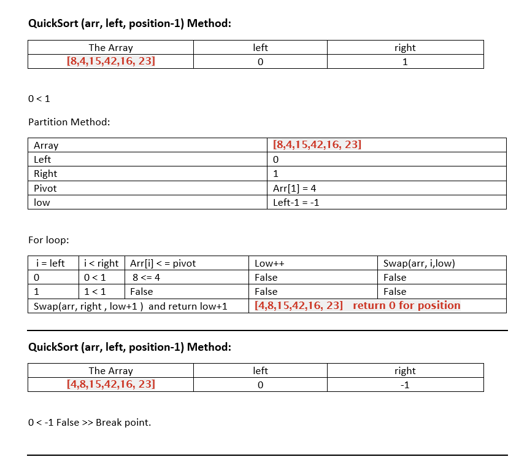
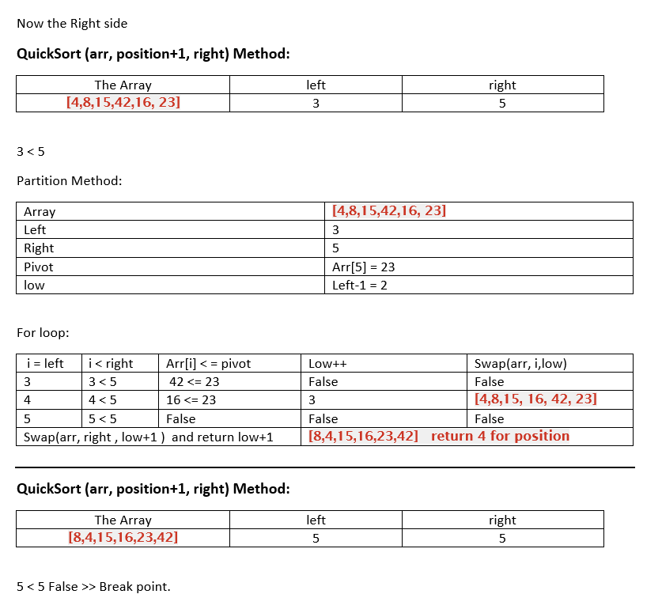

# Quick Sort 
Sort the array by choosing the last right element as a key element and dividing the array into two halves, the left one has the elements which are less than that element and the other right side has the elements which are greater than that element, and keep doing that for each side until reaching an array with one element.  
  
# Pseudo Code
* **QuickSort Method**  
  
* **Portition Method**  
  
* **Swap Method**  
    

# Trace 
* **The Sample Array [8,4,23,42,16,15]**  
  
  
  
