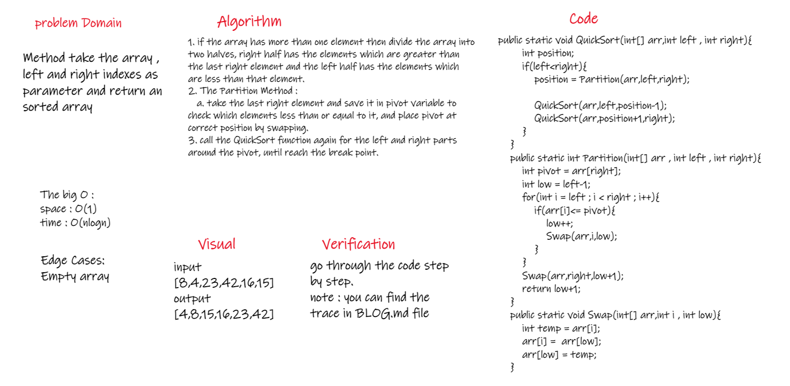
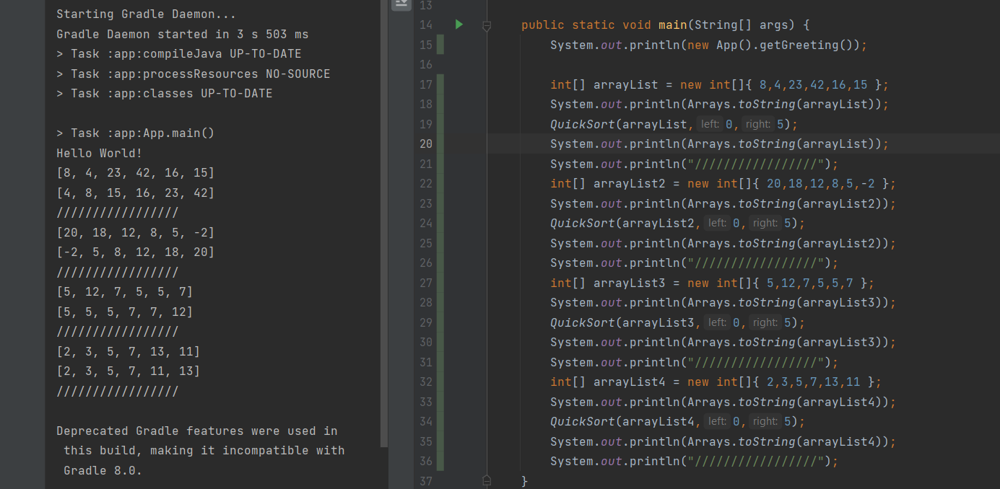

# Challenge Summary
<!-- Description of the challenge -->
Method take an array, first index and last index as parameters and sort it.  

## Whiteboard Process
<!-- Embedded whiteboard image -->
  
  
  
## Approach & Efficiency
<!-- What approach did you take? Why? What is the Big O space/time for this approach? -->
1. if the array has more than one element then divide the array into two halves, right half has the elements which are greater than the last right element and the left half has the elements which are less than that element.  
2. The Partition Method :  
   a. take the last right element and save it in pivot variable to check which elements less than or equal to it, and place pivot at correct position by swapping.  
3. call the QuickSort function again for the left and right parts around the pivot, until reach the break point.  
  
The Big O space O(1) / time is O(nlogn).  
  
  
## Solution
<!-- Show how to run your code, and examples of it in action -->
  
  
[Solution_Link](https://github.com/AlaaYlula/data-structures-and-algorithms/blob/main/Challenge%2328/Quick_Sort/app/src/main/java/Quick_Sort/App.java)  