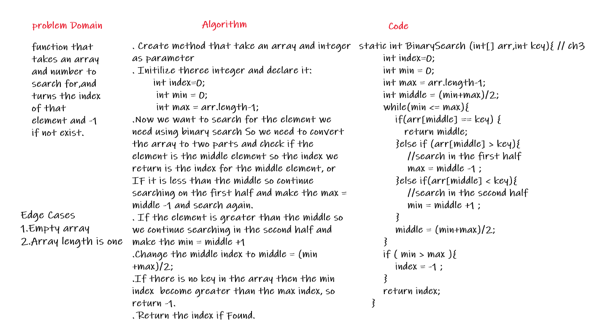
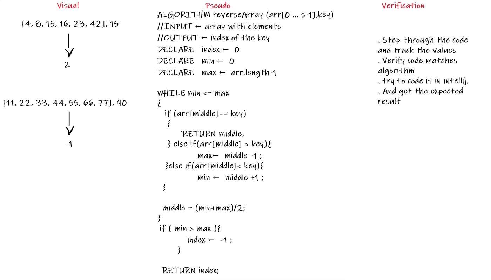

# Binary Search of Sorted Array
<!-- Description of the challenge -->
Method that take an array and number to search for,and turns the index of that number and -1 if not exist in the array.
## Whiteboard Process
<!-- Embedded whiteboard image -->

## Approach & Efficiency
<!-- What approach did you take? Discuss Why. What is the Big O space/time for this approach? -->

* Create method that take an array and integer as parameter  
* Initilize theree integer and declare it:  
       int index=0;  
        int min = 0;  
        int max = arr.length-1;    
* Now we want to search for the element we need using binary search So we need to convert the array to two parts and check if the element is the middle element so the index we return is the index for the middle element, or IF it is less than the middle so continue searching on the first half and make the max = middle -1 and search again.  
* If the element is greater than the middle so we continue searching in the second half and make the min = middle +1.  
* Update the middle index to middle = (min+max)/2;  
* If there is no key in the array then the min index  become greater than the max index, so return -1.  
* Return the index if Found.  