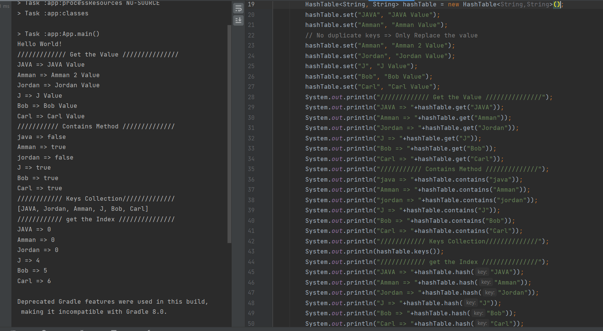

# Hashtables
<!-- Short summary or background information -->
Is a data structure that the data is stored in an array format, where each data value has its own index value. Access to data becomes very fast if we know the index of the desired data.   
## Challenge
<!-- Description of the challenge -->
Implement a Hashtable Class with hash(), set(), get(), contains(), and keys() Methods. 
## Approach & Efficiency
<!-- What approach did you take? Why? What is the Big O space/time for this approach? -->
1. **hash()**: Method which hash the key and generate index in the range of the array size and if it is negative make it positive.  
The Big O space O(1) / time is O(1).  
  
2. **set()**: create head node point to the index, then check if the head point to the null then add the new node, otherwise check if the list already has the key then replace the value for it with the new value, and if this new key then make the next of the node point to the next of the head, and the next of the head point to the new node.  
The Big O space O(1) / time is O(n).  
  
3. **get()**: make a head node point to the index, check if the next of this node is null then that index only has a one element and return the value of the head, otherwise it will loop through all list and check if the key and the hash code are equal to the node the head point to then return the value of this node. If reach the end without any key match then return null.   
The Big O space O(1) / time is O(n).  
  
4. **contains()**:make a head node point to the index, loop through all list and check if the key and the hash code are equal to the node the head point to then return true. If reach the end without any key match then return false.  
The Big O space O(1) / time is O(n).  
  
5. **keys()**: Go through the elements in the bucketArray and add the key from it to the array list.  
The Big O space O(n) / time is O(n).   

## API
<!-- Description of each method publicly available in each of your hashtable --> 
1. **hash()**: Method take the key as argument and returns index in the collection for that key.  
2. **set()**: Method take the key and the value as arguments, and check if that key is already exist then only replace the value for that key.   
3. **get()**: Method take the key as argument and return the value for it.  
4. **contains()**: Method take the key as argument and check if this key is exist in the collection.  
5. **keys()**: Method return the List of the keys which are in the collection.  
  
  

[Solution_Link]()