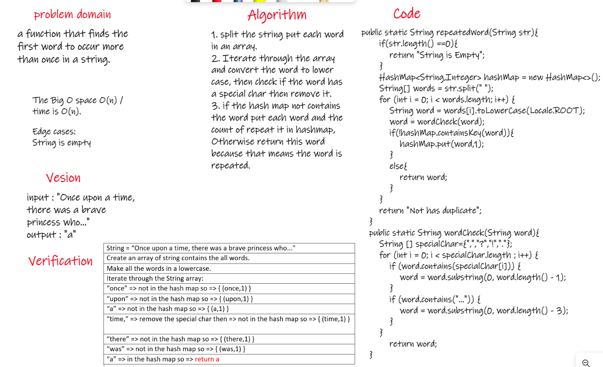
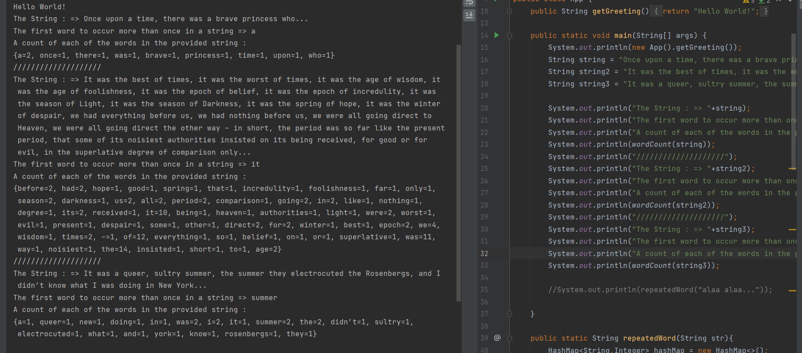

# Challenge Summary
<!-- Description of the challenge -->
Write a function called repeated word that finds the first word to occur more than once in a string.  

## Whiteboard Process
<!-- Embedded whiteboard image -->
  
  
## Approach & Efficiency
<!-- What approach did you take? Why? What is the Big O space/time for this approach? -->
1. split the string put each word in an array.  
2. Iterate through the array and convert the word to lower case, then check if the word has a special char then remove it.  
3. if the hash map not contains the word put each word and the count of repeat it in hashmap, Otherwise return this word because that means the word is repeated.    
The Big O space O(n) / time is O(n).  
  
## Solution
<!-- Show how to run your code, and examples of it in action -->
  

[Solution_Link](https://github.com/AlaaYlula/data-structures-and-algorithms/blob/main/Challenge%2331/hashmap-repeated-word/app/src/main/java/hashmap/repeated/word/App.java)