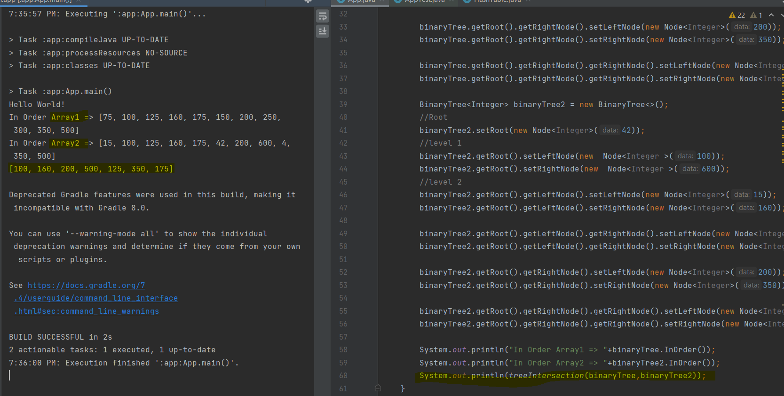

# Challenge Summary
<!-- Description of the challenge -->
function called tree_intersection that takes two binary trees as parameters.  
Using the Hashmap which implementrd in previous challenge, return a set of values found in both trees.  
## Whiteboard Process
<!-- Embedded whiteboard image -->
  
**The Code**
  
  
  
## Approach & Efficiency
<!-- What approach did you take? Why? What is the Big O space/time for this approach? -->
1. create 2 hashmaps.      
2. Method take the tree, two hashtables , and integer to check if this tree 1 or 2 , as parameters, and recursive to save the data of the tree1 in the hashtable1, and in case the tree is 2 then  recursive to check each element in the tree if it is in the hashtable1 then added it to the hashtable2 ( which will store the common elements ).   
3. return the hashtable2.keys() result.     
## Solution
<!-- Show how to run your code, and examples of it in action -->
  

[Solution_Link]()