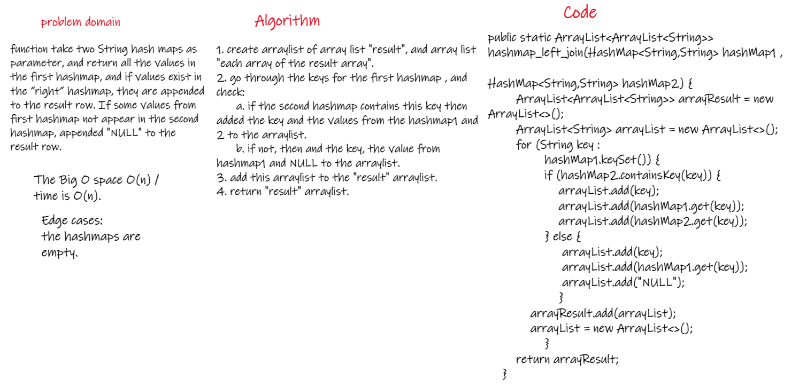
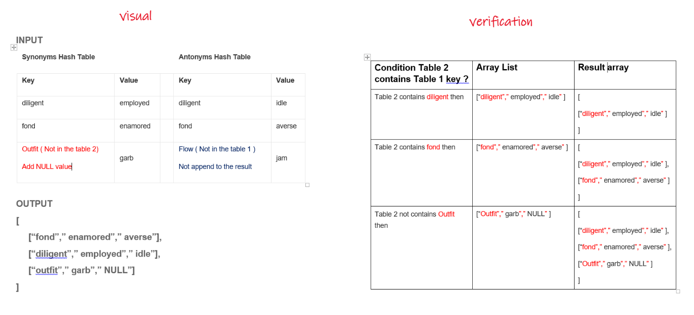

# Hashmap LEFT JOIN
<!-- Short summary or background information -->
LEFT JOIN means all the values in the first hashmap are returned, and if values exist in the “right” hashmap, they are appended to the result row. If some values from first hashmap not appear in the second hashmap, appended "NULL" to the result row.  
## Challenge
<!-- Description of the challenge -->
Write a function called left join  
Arguments: two hash maps  
The first parameter is a hashmap that has word strings as keys, and a synonym of the key as values.  
The second parameter is a hashmap that has word strings as keys, and antonyms of the key as values.  
Return: The returned data structure that holds the results is up to you. It doesn’t need to exactly match the output below, so long as it achieves the LEFT JOIN logic.  
  
## Approach & Efficiency
<!-- What approach did you take? Why? What is the Big O space/time for this approach? -->
1. create arraylist of array list "result", and array list "each array of the result array".   
2. go through the keys for the first hashmap , and check:  
      a. if the second hashmap contains this key then added the key and the values from the hashmap1 and 2 to the arraylist.  
      b. if not, then and the key, the value from hashmap1 and NULL to the arraylist.  
3. add this arraylist to the "result" arraylist.  
4. return "result" arraylist.   
## Solution
<!-- Embedded whiteboard image -->
  
  

[Solutio_Link]()