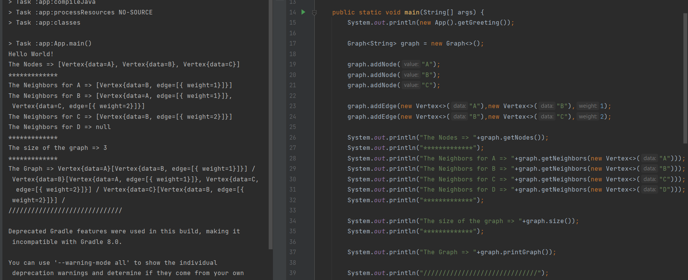

# Graphs
<!-- Short summary or background information -->
A non-linear data structure that can be looked at as a collection of vertices (nodes) potentially connected by line segments named edges.  
The neighbors of the node called Neighbor.  
The number of edges connected to the vertex called Degree.  
## Challenge
<!-- Description of the challenge -->
Implement your own Graph. The graph should be represented as an adjacency list, and should include the following methods:  
1. add node  
2. add edge  
3. get nodes  
4. get neighbors  
5. size  
  
## Approach & Efficiency
<!-- What approach did you take? Why? What is the Big O space/time for this approach? -->
1. **addNode** Method: create Vertex node and add this node to the hashmap as a key and empty arraylist as a value.  
The Big O space O(1) / time is O(1).  
2. **addEdge** Method: check if the nodes are in the graph then, get the values(List of the node connected to this node) and add the other node to this list.(do that for the both nodes).  
 **addEdge** Method with weight: check if the nodes are in the graph then,create edge has the both nodes and the weight, add this edge to the each node, get the values(List of the node connected to this node) and add the other node to this list.(do that for the both nodes).  
The Big O space O(1) / time is O(1).  
3. **getNodes** Method: if the grapgh not empty return the key set of the hashmap(which is set of the nodes), otherwise return null.    
The Big O space O(1) / time is O(1).  
4. **getNeighbors** Method: check if the node is in the gragh, then return the value(which is the list of the nodes connect to it) of this node key from the hashmap.  
The Big O space O(1) / time is O(1).   
5. **size** Method: return the size of the hashmap which is the size of the graph.  
The Big O space O(1) / time is O(1).  
  

## API
<!-- Description of each method publicly available in your Graph -->
1. **addNode** Method: take the value you want to add it as argument. Create Vertex node and add this node to the hashmap as a key and empty arraylist as a value.  
2. **addEdge** Method: take two nodes you want to add edge betweem them as arguments. Check if the nodes are in the graph then, get the values(List of the node connected to this node) and add the other node to this list.(do that for the both nodes).   
**addEdge** Method with weight: check if the nodes are in the graph then,create edge has the both nodes and the weight, add this edge to the each node, get the values(List of the node connected to this node) and add the other node to this list.(do that for the both nodes).  
3. **getNodes** Method: if the grapgh not empty return the key set of the hashmap(which is set of the nodes), otherwise return null.    
4. **getNeighbors** Method: take the node as argument. Check if the node is in the gragh, then return the value(which is the list of the nodes connect to it) of this node key from the hashmap.  
5. **size** Method: return the size of the hashmap which is the size of the graph.  
  
  
  
[Solution_Link]()  