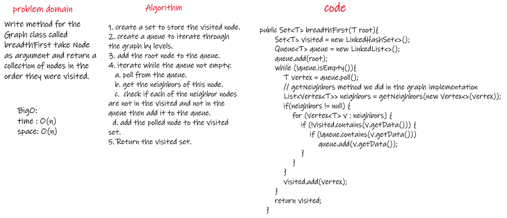
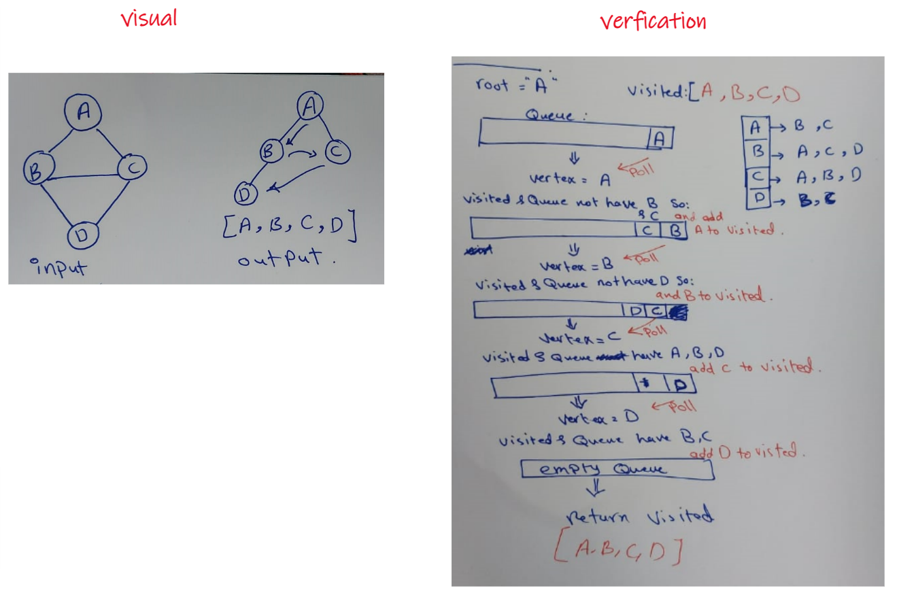
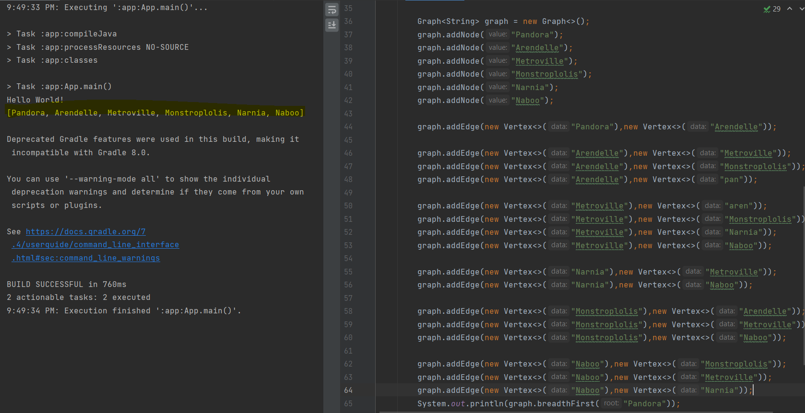

# Challenge Summary
<!-- Description of the challenge -->
Write method for the Graph class called breadth first take Node as argument and return a collection of nodes in the order they were visited.  
## Whiteboard Process
<!-- Embedded whiteboard image -->
  
  
  
## Approach & Efficiency
<!-- What approach did you take? Why? What is the Big O space/time for this approach? -->
1. create a set to store the visited node.  
2. create a queue to iterate through the graph by levels.  
3. add the root node to the queue.  
4. iterate while the queue not empty:  
   a. poll from the queue.  
   b. get the neighbors of this node.   
   c.  check if each of the neighbor nodes are not in the visited and not in the queue then add it to the queue.   
   d. add the polled node to the visited set.   
5. Return the visited set.   
    

## Solution
<!-- Show how to run your code, and examples of it in action -->
  
  
[Solution_Link]()  