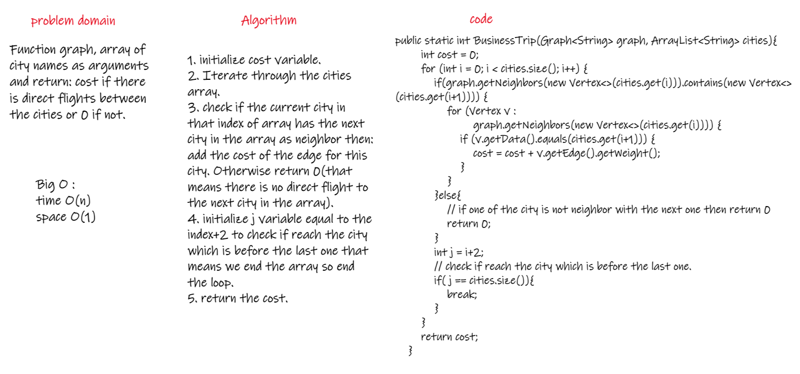
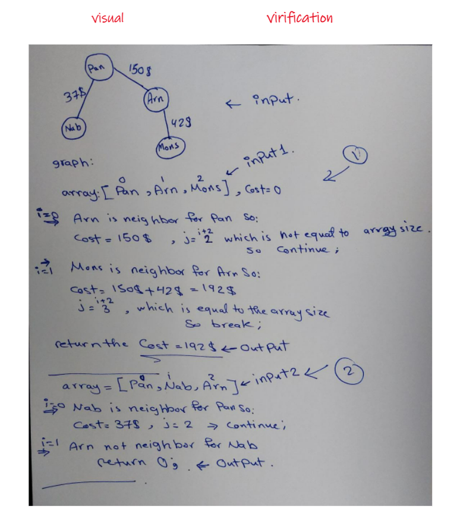
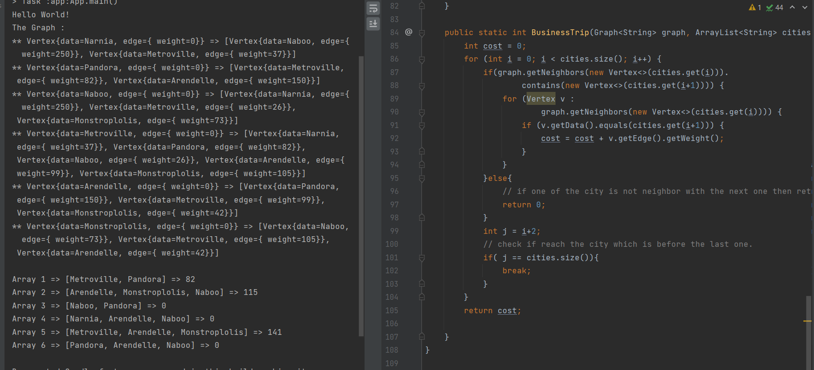

# Challenge Summary
<!-- Description of the challenge -->
Function called business trip, take arguments: graph, array of city names.  
Return: cost or null.  
Determine whether the trip is possible with direct flights, and how much it would cost.  

## Whiteboard Process
<!-- Embedded whiteboard image -->
  
  
  
## Approach & Efficiency
<!-- What approach did you take? Why? What is the Big O space/time for this approach? -->
1. initialize cost variable.  
2. Iterate through the cities array.  
3. check if the current city in that index of array has the next city in the array as neighbor then: add the cost of the edge for this city. Otherwise return 0(that means there is no direct flight to the next city in the array).  
4. initialize j variable equal to the index+2 to check if reach the city which is before the last one that means we end the array so end the loop.  
5. return the cost.  
The Big O: time O(n)/space O(1).  
  
## Solution
<!-- Show how to run your code, and examples of it in action -->
  
  
[Solution_Link](https://github.com/AlaaYlula/data-structures-and-algorithms/blob/main/Challenge%2337/graph-business-trip/app/src/main/java/graph/business/trip/App.java)  