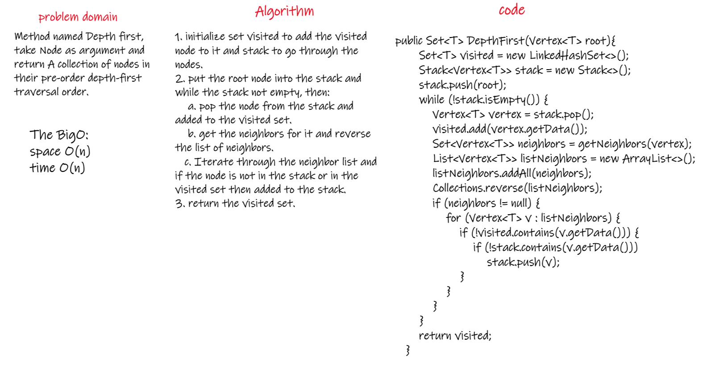
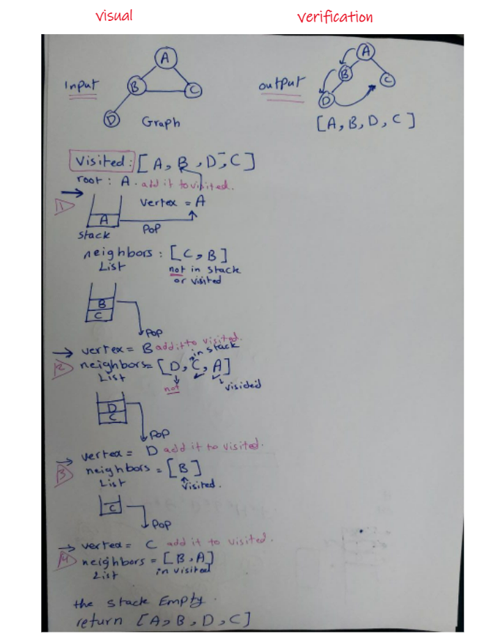

# Depth First Traversal
<!-- Short summary or background information -->
Depth-first search is an algorithm for traversing or searching tree or graph data structures. The algorithm starts at the root node and explores as far as possible along each branch before backtracking(reach the end of the branch node with no child).  
## Challenge
<!-- Description of the challenge -->
Method named Depth first, take Node as argument and return A collection of nodes in their pre-order depth-first traversal order.  
  
## Approach & Efficiency
<!-- What approach did you take? Why? What is the Big O space/time for this approach? -->
1. initialize set visited to add the visited node to it and stack to go through the nodes.   
2. put the root node into the stack and while the stack not empty, then:  
    a. pop the node from the stack and added to the visited set.  
    b. get the neighbors for it and reverse the list of neighbors.  
    c. Iterate through the neighbor list and if the node is not in the stack or in the visited set then added to the stack.  
3. return the visited set.    
The BigO : space O(n) / time O(n) 

## Solution
<!-- Embedded whiteboard image -->
  
  

  
[Solution_Link](https://github.com/AlaaYlula/data-structures-and-algorithms/blob/main/Challenge%2338/graph-depth-first/app/src/main/java/graph/depth/first/structure/Graph.java)  