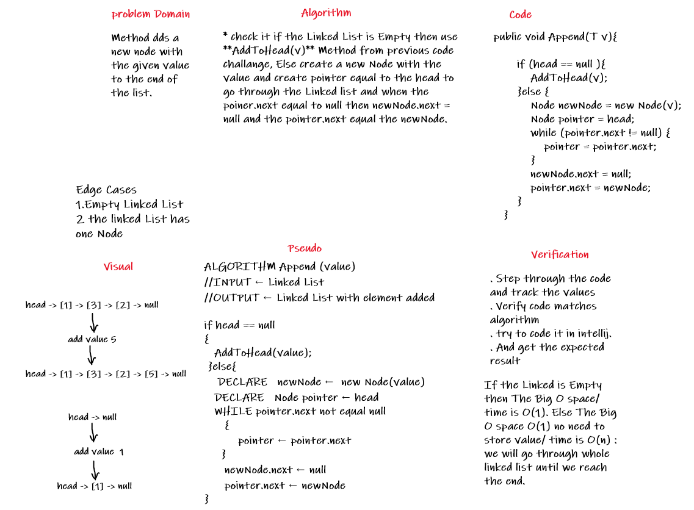
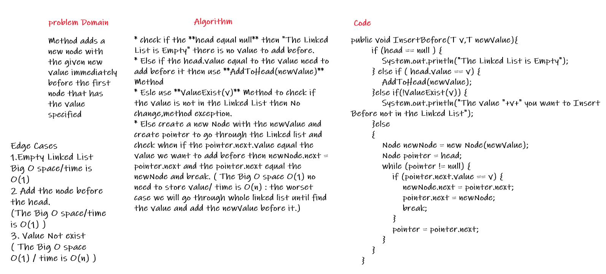
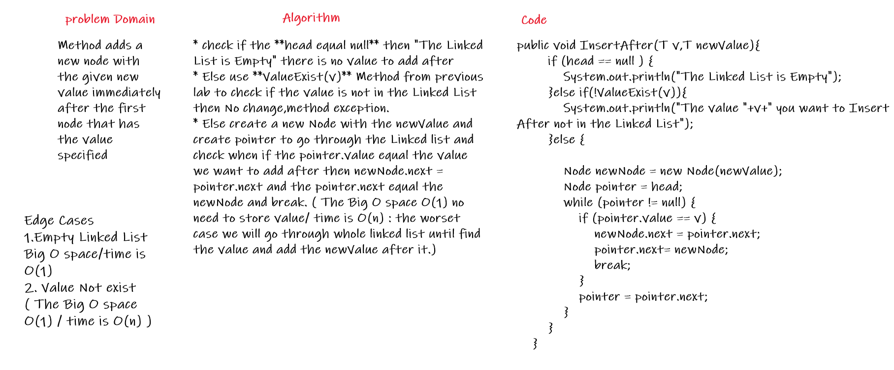
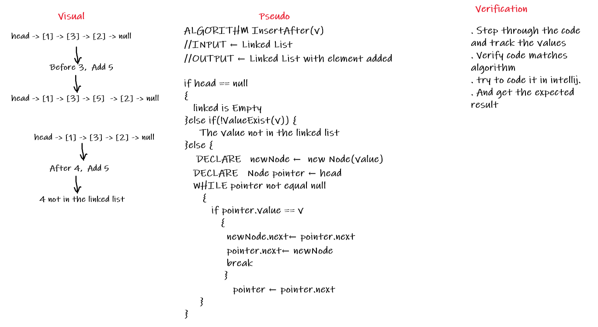
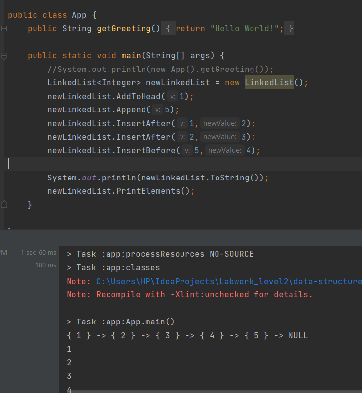

# Challenge Summary
<!-- Description of the challenge -->
Write the following methods for the Linked List class:  
* Append  
arguments: new value  
adds a new node with the given value to the end of the list  
* InsertBefore  
arguments: value, new value  
adds a new node with the given new value immediately before the first node that has the value specified  
* InsertAfter   
arguments: value, new value    
adds a new node with the given new value immediately after the first node that has the value specified  
## Whiteboard Process
<!-- Embedded whiteboard image -->
### Append
  
    
### Add Before  
       
  
  
### Add After  
    
  
  
    
## Approach & Efficiency
<!-- What approach did you take? Why? What is the Big O space/time for this approach? -->
* Append : will add Node at the End of the Linked List, so check it if the Linked List is Empty then use **AddToHead(v)** Method, Else create a new Node with the value and create pointer to go through the Linked list and check when the poiner.next equal to null then newNode.next = null and the pointer.next equal the newNode.  
If the Linked is Empty then The Big O space/time is O(1). Else The Big O space O(1) no need to store value/ time is O(n) : we will go through whole linked list until we reach the end.  
     
* InsertBefore : will add Node before given value, so check if the **head equal null** then "The Linked List is Empty" there is no value to add before( The Big O space/time is O(1) ).  
Else if the head.value equal to the value need to add before it then use **AddToHead(newValue)** Method(The Big O space/time is O(1) )  
Esle use **ValueExist(v)** Method to check if the value is not in the Linked List then No change,method exception.( The Big O space O(1) no need to store value/ time is O(n) : the worset case we will go through whole linked list until find the value or not.)    
Else create a new Node with the newValue and create pointer to go through the Linked list and check when if the pointer.next.value equal the value we want to add before then newNode.next = pointer.next and the pointer.next equal the newNode and break. ( The Big O space O(1) no need to store value/ time is O(n) : the worset case we will go through whole linked list until find the value and add the newValue before it.)    
   
* InsertAfter : will add Node after given value, so check if the **head equal null** then "The Linked List is Empty" there is no value to add after( The Big O space/time is O(1) ).  
Else use **ValueExist(v)** Method to check if the value is not in the Linked List then No change,method exception.( The Big O space O(1) no need to store value/ time is O(n) : the worset case we will go through whole linked list until find the value or not.)  
Else create a new Node with the newValue and create pointer to go through the Linked list and check when if the pointer.value equal the value we want to add after then newNode.next = pointer.next and the pointer.next equal the newNode and break. ( The Big O space O(1) no need to store value/ time is O(n) : the worset case we will go through whole linked list until find the value and add the newValue after it.)      
  
## Solution
<!-- Show how to run your code, and examples of it in action -->
  
  

[Solution_Link](https://github.com/AlaaYlula/data-structures-and-algorithms/tree/main/Challenge%236/list-insertions/app/src)  

  
    

NOTE : The Link for the Previous Challenge : [Challenge#5](https://github.com/AlaaYlula/data-structures-and-algorithms/blob/main/Challenge%234/README4.md)