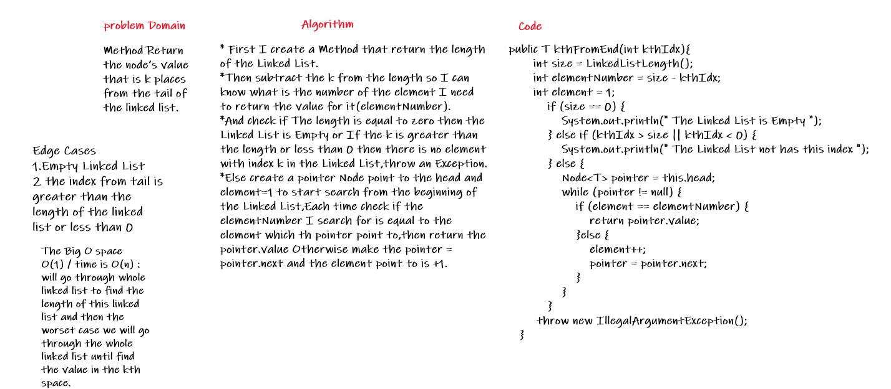
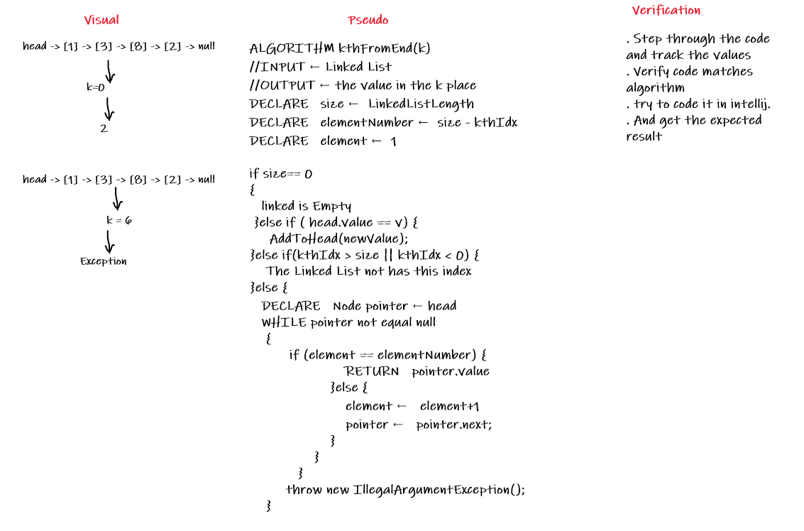
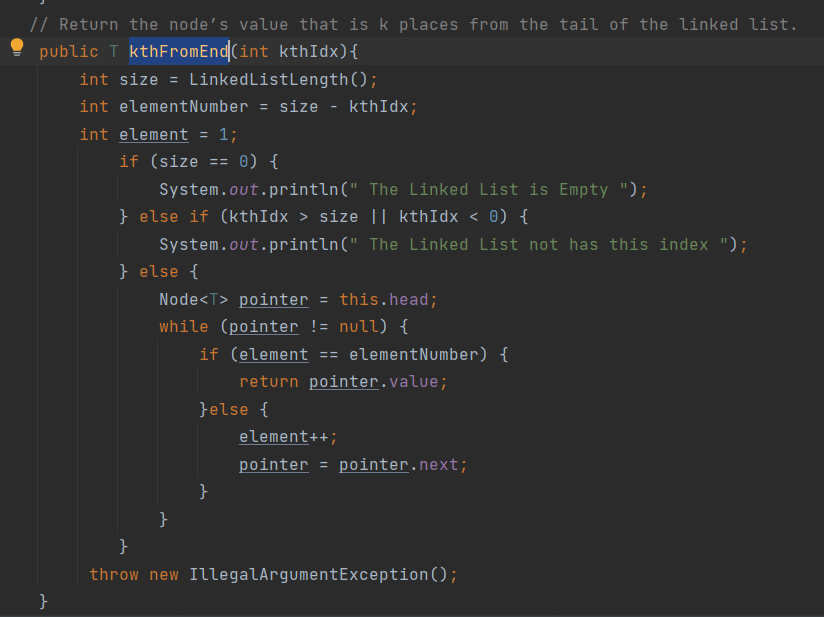
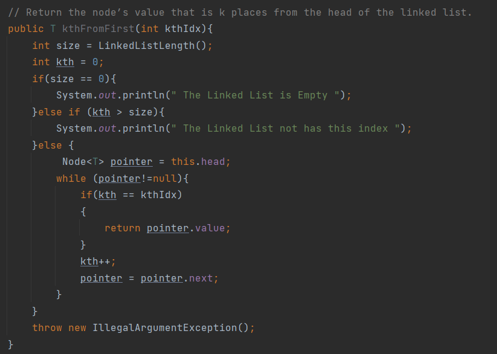
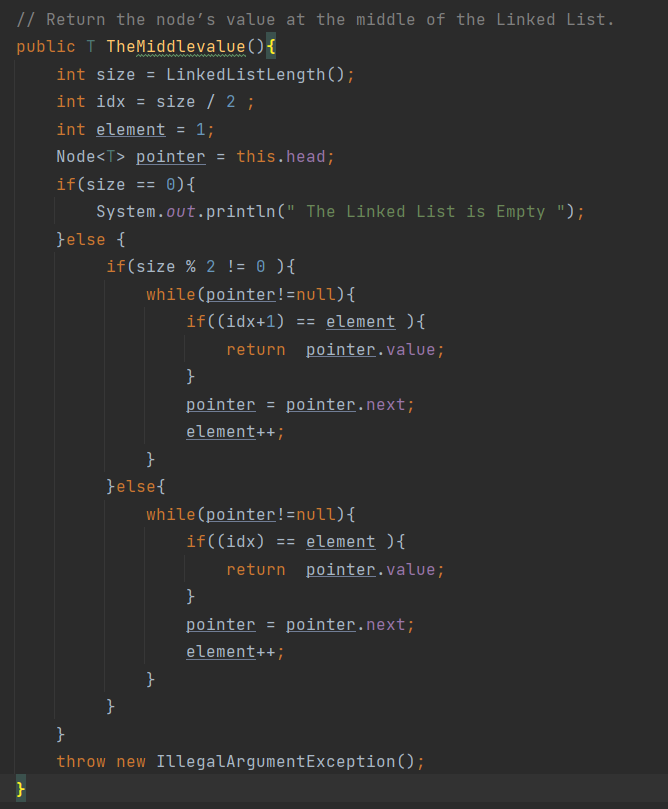
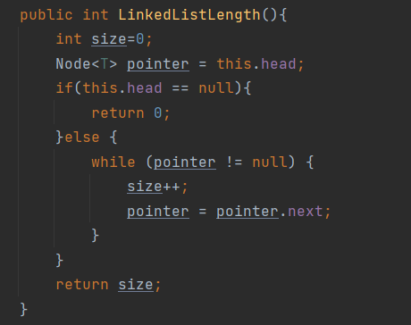
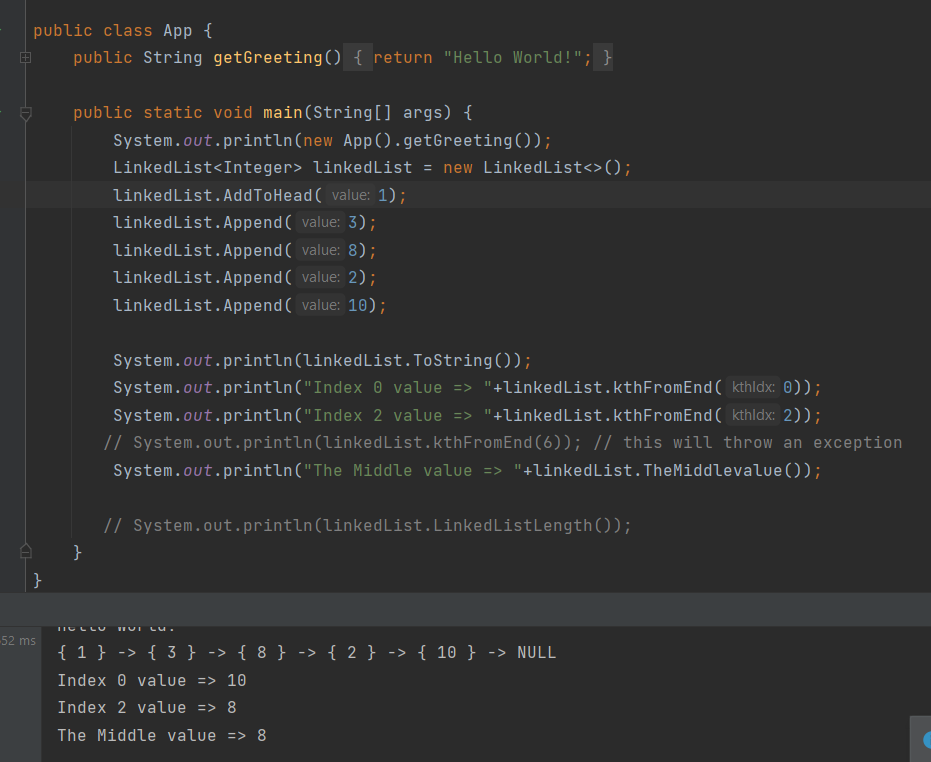

# Challenge Summary
<!-- Description of the challenge -->
Method **kthFromEnd** Return the node’s value that is k places from the tail of the linked list.  
Method **kthFromFirst** Return the node’s value that is k places from the head of the linked list.  
Method **TheMiddlevalue** Return the node’s value at the middle of the Linked List.  
Method **LinkedListLength** Return the length of the Linked List  

## Whiteboard Process
<!-- Embedded whiteboard image -->
  
  
  
  
## Approach & Efficiency
<!-- What approach did you take? Why? What is the Big O space/time for this approach? -->
First I create a Method that return the length of the Linked List.  
Then subtract the k from the length so I can know what is the number of the element I need to return the value for it(elementNumber).  
And check if The length is equal to zero then the Linked List is Empty or If the k is greater than the length or less than 0 then there is no element with index k in the Linked List,throw an Exception.  
Else create a pointer Node point to the head and element=1 to start search from the beginning of the Linked List,Each time check if the elementNumber I search for is equal to the element which th pointer point to,then return the pointer.value Otherwise make the pointer = pointer.next and the element point to is +1.
  
 The Big O space O(1) / time is O(n) :  will go through whole linked list to find the length of this linked list and then the worset case we will go through the whole linked list until find the value in the kth space.    

## Solution
<!-- Show how to run your code, and examples of it in action -->
**kthFromEnd**  
  
  
 **kthFromFirst**  
  
  
 **TheMiddlevalue**  
  
  
**LinkedListLength**  
  

  
  

[Solution_Link]()

NOTE : The Link for the Previous Challenge : [Challenge#6](https://github.com/AlaaYlula/data-structures-and-algorithms/blob/main/Challenge%236/README.md)

