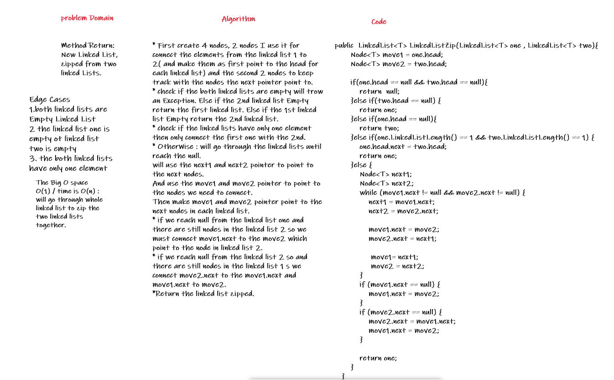
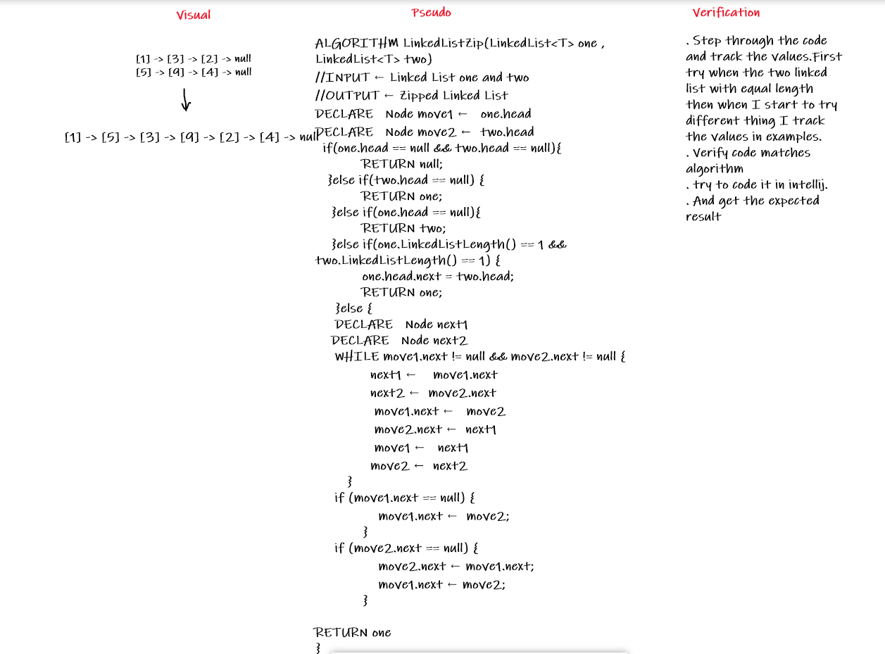
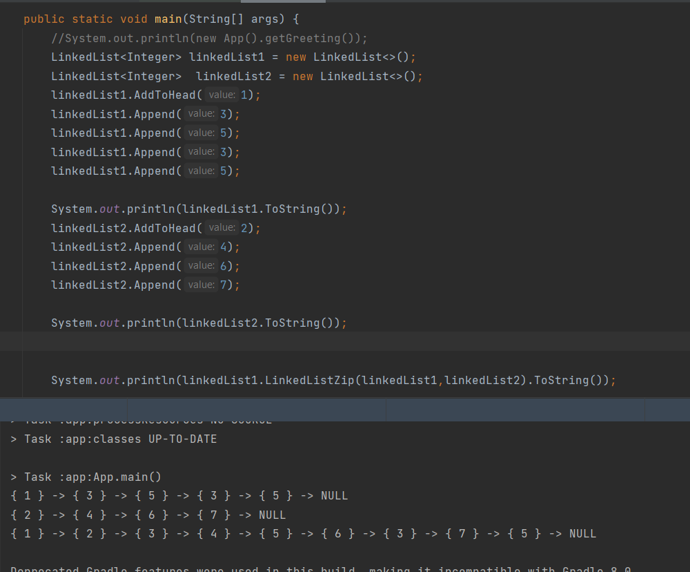

# Challenge Summary
<!-- Description of the challenge -->
Method Return: New Linked List, zipped from two linked Lists.
## Whiteboard Process
<!-- Embedded whiteboard image -->
  
  
  
## Approach & Efficiency
<!-- What approach did you take? Why? What is the Big O space/time for this approach? -->
* First create 4 nodes, 2 nodes I use it for connect the elements from the linked list 1 to 2( and make them as first point to the head for each linked list) and the second 2 nodes to keep track with the nodes the next pointer point to.  
* check if the both linked lists are empty will trow an Exception. Else if the 2nd linked list Empty return the first linked list. Else if the 1st linked list Empty return the 2nd linked list.  
* check if the linked lists have only one element then only connect the first one with the 2nd.  
* OtherWise : will go through the linked lists until reach the null.  
will use the next1 and next2 pointer to point to the next nodes.  
And use the move1 and move2 pointer to point to the nodes we need to connect.  
Then make move1 and move2 pointer point to the next nodes in each linked list.   
* if we reach null from the linked list one and there are still nodes in the linked list 2 so we must connect move1.next to the move2 which point to the node in linked list 2.  
* if we reach null from the linked list 2 so and there are still nodes in the linked list 1 s we connect move2.next to the move1.next and move1.next to move2.  
*Return the linked list zipped.  
  
The Big O space O(1) / time is O(n) :  will go through whole linked list to zip the two linked lists together.  

## Solution
<!-- Show how to run your code, and examples of it in action -->
  
  

[Solution_Link]()  
  
NOTE : The Link for the Previous Challenge : [Challenge#7](https://github.com/AlaaYlula/data-structures-and-algorithms/tree/main/Challenge%237)

